# PRD: Recall Gap, an AI Discovery Engine for Memory-Based Photo Retrieval

| Field | Value |
|---|---|
| Owner | Shravani (PM) |
| Status | Approved v1 |
| Project | Google Photos Core Experience: memory-based photo retrieval, Part 1 |
| Companion spec | `docs/extraction_spec.md` (schema, enums, taxonomy, hypothesis rules). This PRD references it and does not repeat it. |
| Build approach | Spec-driven development in Google Antigravity |

> Working name "Recall Gap" is a placeholder. Rename freely.

**Requirement IDs.** Every requirement has an ID (`FR-`, `NFR-`, `DR-`). Architecture docs, implementation plans and tasks must reference these IDs so every piece of code traces back to a requirement.

**Priority levels.** `P0` = required for the demo. `P1` = strongly expected, build after all P0. `P2` = stretch.

---

## 1. Background

Google Photos users hold thousands of photos accumulated over years. Search works when users know precise criteria (a date, a name, a place). It breaks down when memory is incomplete: users remember *that* a photo exists and fragments about it ("the medicine I took when I was sick", "the photo my friend sent around the concert") but can't translate those fragments into a query the system understands.

The broader project aims to increase the share of users who successfully retrieve a photo they remember but cannot precisely describe. Part 1 requires an AI-powered system that analyzes public user feedback at scale and helps identify and compare retrieval problems and opportunity areas using real user evidence. Part 2 validates the most promising opportunities through user research.

This tool is the Part 1 deliverable and the evidence base for Part 2.

## 2. Problem statement for the tool

A PM investigating memory-based retrieval failures faces thousands of unstructured public posts in multiple languages, most of which are irrelevant (storage, pricing, backup). Reading them manually does not scale, and generic sentiment or topic analysis only produces "search is bad", which is not actionable.

The PM needs a system that turns individual posts into structured **retrieval episodes** (what the user wanted, what they remembered, what they forgot, what they tried, why it failed, what they did instead), then aggregates those episodes into comparable problem types, a remembered-vs-searchable gap map, and evidence-backed hypotheses ready for user research.

## 3. Goals and non-goals

### 3.1 Goals
- **G1.** Convert public posts from multiple sources and languages into structured retrieval episodes with traceable evidence.
- **G2.** Answer the project's research questions with counts and quotes: what photos are hard to retrieve, what users remember, what they forget, how they form queries, where the experience breaks, which segments are affected.
- **G3.** Compare retrieval problem types (archetypes) and rank opportunity areas with a transparent scoring formula.
- **G4.** Evaluate 8 starting hypotheses with supporting and contradicting evidence, and surface emergent patterns not in the hypothesis list.
- **G5.** Produce a clear handoff to Part 2: which hypotheses to test, which segments to recruit, which archetype to go deep on, and what to drop.
- **G6.** Let a mentor or evaluator understand how the tool works and trust its output within 3 minutes.
- **G7.** Run entirely on free tiers.

### 3.2 Non-goals
- Improving or rebuilding Google Photos search.
- Generating the final product recommendation. The tool provides evidence; the PM makes the call.
- Sentiment analysis. It does not serve the research questions.
- Real-time or continuous monitoring. Data is collected in batches.
- Multi-user accounts, roles, or collaboration features.
- Measuring prevalence across the whole user base. Public data is biased; counts are signals, not population estimates.

## 4. Users

| User | Needs | Primary pages |
|---|---|---|
| **PM (primary)** | Explore evidence, compare problems, decide what to take into Part 2 | All |
| **Mentor / evaluator** | Understand the method quickly, judge rigor, spot-check evidence | How it works, Hypothesis board, Evidence browser |
| **Future research participant screener (indirect)** | Clear criteria for who to recruit | Research handoff |

### 4.1 Key user stories
- **US-1.** As the PM, I want to see how many posts were collected, filtered and turned into episodes, so I know if I have enough data to decide anything.
- **US-2.** As the PM, I want to see each hypothesis with evidence for and against, so I can decide which ones to validate.
- **US-3.** As the PM, I want to see which memory cues users rely on versus which ones search can use, so I can locate the biggest gaps.
- **US-4.** As the PM, I want to compare two problem types side by side, so I can prioritize between them.
- **US-5.** As the PM, I want to click any number and see the underlying posts, so every claim is verifiable.
- **US-6.** As the PM, I want to ask questions in natural language and get answers backed by cited posts.
- **US-7.** As the PM, I want interview questions, task ideas and screener criteria drafted per hypothesis, so Part 2 starts fast.
- **US-8.** As a mentor, I want a plain explanation of how the tool works with live numbers and known limitations, so I can trust (or challenge) its output.

## 5. Success metrics (for the tool itself)

| ID | Metric | Target |
|---|---|---|
| SM-1 | `specific_episode` records extracted | Minimum 120, target 200+ |
| SM-2 | `success_or_tip` records extracted | Minimum 20 |
| SM-3 | Relevance classification accuracy on golden set | 85%+ |
| SM-4 | Enum field accuracy (category, origin, outcome, archetype) | 75%+ |
| SM-5 | Cue recall on golden set | 70%+ |
| SM-6 | Chat answers with at least one valid citation | 100% (or explicit "not enough evidence") |
| SM-7 | Hypotheses reaching `directional` or `strong` evidence | At least 5 of 8 |
| SM-8 | Total infrastructure cost | $0 beyond free tiers and existing free credits |
| SM-9 | Database storage used | Under 250MB (50% of the 500MB limit) |

---

## 6. Scope overview

| Area | P0 | P1 | P2 |
|---|---|---|---|
| Sources | Reddit, Play Store, App Store, YouTube | Google Photos Community forum, Hacker News, competitor data (Samsung Gallery Play reviews, Apple Photos Reddit discussions) | Anything else |
| Pipeline | Ingest, dedup, relevance filter, extraction, embedding, analysis | Literature ingestion, golden set evaluation, emergent label review | Agentic hypothesis loop |
| Pages | Overview, Hypothesis board, Gap matrix, Archetype explorer, Evidence browser, Ask the corpus, How it works | Segment explorer, Research handoff | Custom report builder |
| Platform | Password gate, deploy to Vercel + Railway + Neon | CSV export, chat rate limiting dashboard | Scheduled pipeline runs |

Note on competitors: Apple Photos is built into iOS and has no App Store reviews, so Apple Photos evidence comes from Reddit discussions only.

---

## 7. System overview

```mermaid
flowchart LR
    subgraph Sources
        R[Reddit via Apify]
        P[Play Store via google-play-scraper]
        A[App Store via SerpApi]
        Y[YouTube Data API]
        C[Community forum / HN, P1]
    end

    subgraph Pipeline["Pipeline (Python CLI, runs locally)"]
        I[Ingest] --> D[Dedup + language detect]
        D --> F[Stage 1: relevance filter, Gemini]
        F --> X[Stage 2: episode extraction, Gemini]
        X --> E[Embed summaries, fastembed BGE-small]
        E --> AN[Analysis: hypotheses, archetypes, gap matrix, scores]
    end

    subgraph Data["Neon Postgres + pgvector"]
        DB[(Tables + halfvec embeddings)]
    end

    subgraph Backend["FastAPI on Railway"]
        API[Read APIs]
        CHAT[RAG chat: rewrite, embed, retrieve, answer]
    end

    subgraph Frontend["Next.js on Vercel"]
        UI[Dashboard pages + chat]
    end

    Sources --> I
    AN --> DB
    DB --> API
    DB --> CHAT
    API --> UI
    CHAT --> UI
```



**Key architectural decision (AD-1): the pipeline runs offline from the PM's machine as a CLI, writing directly to Neon.** The deployed backend never writes research data to the database; its only DB writes are to `chat_cache` (caching chat responses for the 7-day TTL). Rate limiting is enforced in memory. Reasons: scraping and extraction are slow and quota-bound, Railway's free tier is time-limited, and a near-read-only deployment makes the demo fast and reliable.

**AD-2: all heavy analysis is precomputed.** Pages read materialized results; nothing is aggregated by an LLM at request time except chat answers.

**AD-3: every aggregate links back to episodes, and every episode links back to its source post.**

### 7.1 Tech stack

| Layer | Choice |
|---|---|
| Frontend | Next.js (App Router), TypeScript, Tailwind CSS, shadcn/ui, Recharts |
| Backend | FastAPI, Python 3.11+, SQLAlchemy or asyncpg, Pydantic v2 |
| Pipeline | Python CLI (Typer), same codebase and models as backend |
| Database | Neon Postgres (free tier, 500MB) with pgvector, `halfvec(384)` |
| LLM | Gemini API, multiple keys in round robin. Model IDs configured by env var |
| Embeddings | `fastembed` with `BAAI/bge-small-en-v1.5` (384 dims, ONNX, CPU) |
| Language detection | `langdetect` plus a Devanagari regex and Hinglish marker heuristic |
| Hosting | Vercel (frontend), Railway (backend, 30-day free tier) |

### 7.2 Suggested repository layout

```
/docs
  PRD.md
  extraction_spec.md
  architecture.md           (generated next)
  implementation_plan.md    (generated next)
/shared                     (Pydantic models, enums from extraction_spec)
/pipeline
  sources/                  (one module per source)
  stages/                   (dedup, filter, extract, embed, analyze)
  prompts/                  (versioned prompt files)
  llm/                      (Gemini client, key pool)
  cli.py
/backend
  api/
  services/                 (retrieval, chat, aggregates)
  main.py
/frontend
  app/                      (one route per page)
  components/
/db
  migrations/
/data                       (local only, gitignored)
```

---

## 8. Functional requirements: data collection

### 8.1 General

| ID | Requirement | Priority |
|---|---|---|
| FR-1 | Each source is an independent module implementing a common interface: `fetch(since: datetime) -> list[RawRecord]`. | P0 |
| FR-2 | Only records from the last 24 months are stored. The cutoff is computed at run time. | P0 |
| FR-3 | Store only needed fields: id, source, item type, product, url, created_at, text, hashed author, and a small `extra` JSON (stars, subreddit, country). Never store raw API payloads. | P0 |
| FR-4 | Author names are hashed (SHA-256, first 12 chars) before storage. Plain usernames are never persisted. | P0 |
| FR-5 | Ingestion is idempotent: re-running a source upserts by `record_id` without creating duplicates. | P0 |
| FR-6 | Each run writes a `pipeline_runs` row with source, counts fetched, counts stored, errors, start and end time. | P0 |
| FR-7 | Per-source caps are configurable to protect free quotas. | P0 |

### 8.2 Sources

| ID | Source | Method | Scope and config | Priority |
|---|---|---|---|---|
| FR-8 | Reddit | Apify actor `harshmaur/reddit-scraper` via `run-sync-get-dataset-items` | `searchTerms` across Reddit (e.g. "google photos can't find photo", "google photos search not finding", "find old photo google photos", "ask photos"), plus searches `withinCommunity` r/googlephotos. `searchPosts` and `searchComments` on. `postedAfter` = cutoff. Stores posts and comments as separate records. Hindi and Hinglish terms included. | P0 |
| FR-9 | Play Store | `google-play-scraper` (no key) | App `com.google.android.apps.photos`. Locales: en-in, en-us, hi-in. Sort newest. Stop at cutoff. | P0 |
| FR-10 | App Store | SerpApi `engine=apple_reviews` | Google Photos iOS app ID (verify from App Store URL). Countries us and in. Sort `mostrecent`. Page cap configurable to stay within free monthly searches. | P0 |
| FR-11 | YouTube | YouTube Data API v3 | `search.list` for recent videos on Google Photos search and Ask Photos (published after cutoff), then `commentThreads.list` per video. Quota cap configurable. | P0 |
| FR-12 | Google Photos Community forum | requests + BeautifulSoup, or manual CSV import fallback | Threads matching retrieval keywords. If scraping is blocked or JS-rendered, support `import-csv` command instead. | P1 |
| FR-13 | Hacker News | Algolia HN Search API (no key) | Stories and comments mentioning Google Photos search. | P1 |
| FR-14 | Competitor data | Play Store scraper for Samsung Gallery (`com.sec.android.gallery3d`); Reddit searches for Apple Photos search problems | Tagged with `product` accordingly. | P1 |
| FR-15 | Manual import | CLI command `import-csv` accepting `source,url,created_at,text` | For any source that fails or for hand-collected posts. | P0 |

---

## 9. Functional requirements: processing pipeline

### 9.1 Record lifecycle

Every record has a `status`:

```
raw -> deduped -> filtered -> extracted -> embedded
                     |            |
                     v            v
                 excluded    extract_failed
```

| ID | Requirement | Priority |
|---|---|---|
| FR-20 | Each stage processes only records in its input status and advances them. A crash mid-run resumes from the last committed batch. | P0 |
| FR-21 | Failed records increment `retry_count` and store the error. After 3 failures they move to `extract_failed` and are shown in Overview. | P0 |
| FR-22 | CLI commands: `ingest --source <name|all>`, `dedup`, `filter`, `extract`, `embed`, `analyze`, `handoff`, `eval --labels <csv>`, `import-literature <path>`, `import-csv <path>`, `trim`, `status`, `run-all`. | P0 |
| FR-23 | `status` prints counts per status, per source, and current DB size. | P0 |

### 9.2 Dedup and language

| ID | Requirement | Priority |
|---|---|---|
| FR-24 | Exact duplicates removed by normalized text hash. | P0 |
| FR-25 | Near-duplicates (cross-posts, copy-paste reviews) flagged when normalized text similarity exceeds a threshold (e.g. MinHash or trigram Jaccard > 0.9). The newest copy is kept. | P1 |
| FR-26 | Language detected per record: `en`, `hi` (Devanagari), `hi-Latn` (Hinglish heuristic), `other`. | P0 |
| FR-27 | Records shorter than 20 characters are excluded. Records over 1,500 words are truncated and flagged `truncated=true`. | P0 |

### 9.3 Stage 1: relevance filter

| ID | Requirement | Priority |
|---|---|---|
| FR-30 | Keyword prefilter (English, Hindi, Hinglish lists in config) marks `keyword_hit`. English records without a keyword hit are excluded without an LLM call. Non-English records always go to the LLM. | P0 |
| FR-31 | Gemini (filter model) classifies records in batches of ~25 into the five `relevance_class` values defined in `extraction_spec.md` Section 1, with a short reason. | P0 |
| FR-32 | `irrelevant` and `lost_not_hidden` records move to `excluded`. The `trim` command nulls their text to save storage while keeping id, source, class and date. | P0 |
| FR-33 | A configurable random 5% of keyword-miss English records are also sent to the LLM, so the tool can estimate how much relevant content the prefilter misses. The estimate appears on How it works. | P1 |

### 9.4 Stage 2: extraction

| ID | Requirement | Priority |
|---|---|---|
| FR-40 | Gemini (extraction model) extracts records in batches of 10 to 15 using structured output bound to the Pydantic schema generated from `extraction_spec.md` Section 2. | P0 |
| FR-41 | All output fields are English except `quote_original`. `quote_en` is always filled. | P0 |
| FR-42 | Output is validated against the schema and enums. On validation failure, retry once with the validation error appended; then mark `extract_failed`. | P0 |
| FR-43 | Each record yields 0 to 3 episodes. General complaints yield 0 episodes but store `general_failure_modes`. | P0 |
| FR-44 | Cues, forgotten cues and queries are stored in normalized child tables (Section 11) so aggregates are plain SQL. | P0 |
| FR-45 | Every episode stores `prompt_version` and `model_id` for reproducibility. | P0 |
| FR-46 | `archetype_primary = emergent` requires `emergent_label`. Emergent labels are listed in a review queue (CLI in P1, UI in P2) where the PM promotes them to a new archetype or merges them into an existing one. | P1 |

### 9.5 LLM client and key rotation

| ID | Requirement | Priority |
|---|---|---|
| FR-50 | `GEMINI_API_KEYS` holds a comma-separated list. A `KeyPool` rotates keys round robin per request. | P0 |
| FR-51 | On HTTP 429 or quota errors, the key enters cooldown with exponential backoff; the pool continues with remaining keys. If all keys are cooling down, the stage pauses until the earliest cooldown ends. | P0 |
| FR-52 | Configurable per-key requests-per-minute ceiling enforced client-side. | P0 |
| FR-53 | Model IDs are env vars: `GEMINI_FILTER_MODEL` (Flash-Lite class), `GEMINI_EXTRACT_MODEL` and `GEMINI_CHAT_MODEL` (Flash class). | P0 |
| FR-54 | Prompts live in versioned files under `pipeline/prompts/` (e.g. `extract_v1.md`). Changing a prompt means a new version file, never editing in place. | P0 |
| FR-55 | Token usage per call is logged to `pipeline_runs` for cost and quota visibility. | P1 |

### 9.6 Embedding

| ID | Requirement | Priority |
|---|---|---|
| FR-60 | Only `summary_en` of each episode is embedded, using fastembed `BAAI/bge-small-en-v1.5`. Raw posts are never embedded. | P0 |
| FR-61 | Stored as `halfvec(384)` with an HNSW index using cosine distance. | P0 |
| FR-62 | Literature chunks (P1) are embedded with the same model into a separate table. | P1 |

---

## 10. Functional requirements: analysis layer

All analysis runs in the `analyze` command and writes materialized results. Recomputing is safe and idempotent.

### 10.1 Evidence strength

| ID | Requirement | Priority |
|---|---|---|
| FR-70 | Every aggregate displayed in the UI carries an evidence label based on its episode count: `strong` (30+), `directional` (15 to 29), `anecdotal` (under 15). Thresholds in config. | P0 |

### 10.2 Hypotheses

| ID | Requirement | Priority |
|---|---|---|
| FR-71 | The 8 hypotheses (Appendix A) are seeded into a `hypotheses` table. | P0 |
| FR-72 | Each hypothesis has a rule implemented in code (per `extraction_spec.md` Section 5) that classifies each episode as `support`, `contradict` or not relevant. The LLM never judges hypotheses directly. | P0 |
| FR-73 | H5 and H6 are distribution comparisons, not per-episode rules. H5 compares cue and failure distributions between memory and utility photo groups. H6 compares `date_imprecision` share across `photo_age_bucket`. Results store the compared distributions for charting. | P0 |
| FR-74 | Status per hypothesis: `supported` (support at least 2x contradict and at least 15 relevant), `contradicted` (contradict at least 2x support and at least 15 relevant), `mixed` (otherwise, at least 15 relevant), `insufficient_data` (under 15 relevant). Thresholds in config. | P0 |
| FR-75 | Each hypothesis stores its top 5 supporting and top 3 contradicting episodes, ranked by extraction confidence then source diversity. | P0 |

### 10.3 Archetypes and opportunity score

| ID | Requirement | Priority |
|---|---|---|
| FR-80 | Per archetype: episode count, share of all episodes, outcome distribution, top cue types, top failure modes, top workarounds, source mix, language mix. | P0 |
| FR-81 | Severity per episode: `gave_up` = 3, `still_searching` = 3, `found_with_effort` = 2, `found_easily` = 1, `unknown` excluded from the average. | P0 |
| FR-82 | Stakes weight: `practical_urgent` = 1.5, `sentimental` = 1.3, `practical_routine` = 1.0, `unknown` = 1.0. | P0 |
| FR-83 | Opportunity score per archetype = `share_of_episodes x avg_severity x avg_stakes_weight`, normalized to 0 to 100 across archetypes. Formula and weights are shown in the UI and configurable. | P0 |

### 10.4 Gap matrix

| ID | Requirement | Priority |
|---|---|---|
| FR-85 | For each cue type: how often it's remembered (share of episodes), precision mix (exact, approximate, vague), how often it's explicitly forgotten, and failure rate of episodes where it's the strongest cue. | P0 |
| FR-86 | A `capability_reference` table, curated by the PM (seeded from a YAML file), records per cue type whether Google Photos can use it today: `yes`, `partial`, `no`, plus a note and how it was verified. The LLM never fills this. | P0 |
| FR-87 | Gap score per cue = `remembered_share x (1 if no, 0.5 if partial, 0 if yes)`. Cues are ranked by gap score. | P0 |

### 10.5 Segments (P1)

| ID | Requirement | Priority |
|---|---|---|
| FR-90 | Cross-tabs of archetype and outcome by: photo category group (memory vs utility), photo origin, platform, language, role hints, product. | P1 |
| FR-91 | Cells under 10 episodes are shown greyed with the `anecdotal` label. | P1 |

### 10.6 Research handoff (P1)

| ID | Requirement | Priority |
|---|---|---|
| FR-95 | For each hypothesis with status other than `insufficient_data`, Gemini drafts: 3 to 5 interview questions, 1 to 2 retrieval task ideas, and screener criteria, grounded in the hypothesis's evidence episodes. | P1 |
| FR-96 | Drafts are stored, labeled "AI draft" in the UI, and regenerated only on the `handoff` command. | P1 |
| FR-97 | The four decision points (D1 to D4 from `extraction_spec.md` Section 9.3) are computed and shown as a summary at the top of the page. | P1 |

### 10.7 Evaluation (P1)

| ID | Requirement | Priority |
|---|---|---|
| FR-98 | `eval --labels <csv>` imports hand labels (exported from the golden set workbook) and computes relevance accuracy, per-field enum accuracy and cue recall against the pipeline's output for the same records. Results stored in `eval_results`. | P1 |
| FR-99 | If no evaluation has been run, How it works states "Accuracy not yet measured" rather than hiding the section. | P0 |

---

## 11. Data requirements

### 11.1 Tables

| Table | Key columns | Notes |
|---|---|---|
| `raw_records` | `record_id` PK, `source`, `item_type` (post, comment, review), `product`, `url`, `author_hash`, `created_at`, `lang`, `text` (nullable after trim), `text_len`, `truncated`, `keyword_hit`, `relevance_class`, `relevance_reason`, `general_failure_modes` text[], `platform`, `mentions_ask_photos`, `ask_photos_note`, `status`, `retry_count`, `last_error`, `extra` jsonb, `ingested_at`, `run_id` | One row per post, comment or review |
| `episodes` | `episode_id` PK, `record_id` FK, `episode_no`, all scalar fields from spec Section 2.2, `failure_modes` text[], `workarounds` text[], `role_hints` text[], `summary_en`, `quote_original`, `quote_en`, `extraction_confidence`, `prompt_version`, `model_id`, `embedding` halfvec(384) | HNSW index on `embedding` |
| `episode_cues` | `id` SERIAL PK, `episode_id` FK, `cue_type`, `value`, `precision` | Surrogate PK; remembered cues |
| `episode_forgotten` | `id` SERIAL PK, `episode_id` FK, `cue_type`, `evidence` | Surrogate PK; explicit only |
| `episode_queries` | `id` SERIAL PK, `episode_id` FK, `query_text`, `query_style`, `position` | Surrogate PK; order preserved |
| `hypotheses` | `hypothesis_id` PK (H1 to H8), `title`, `statement`, `status`, `support_count`, `contradict_count`, `relevant_count`, `evidence_strength`, `details` jsonb, `computed_at` | `details` holds distributions for H5 and H6 |
| `hypothesis_evidence` | (`hypothesis_id`, `episode_id`) composite PK, `direction`, `rank` | Built by rules; `rank` orders top 5 support / top 3 contradict |
| `archetype_stats` | `archetype` PK, counts, distributions jsonb, `avg_severity`, `avg_stakes_weight`, `opportunity_score`, `evidence_strength`, `computed_at` | Materialized |
| `cue_stats` | `cue_type` PK, `remembered_share`, precision mix, `forgotten_count`, `failure_rate`, `gap_score`, `computed_at` | Materialized |
| `capability_reference` | `cue_type` PK, `searchable` (yes, partial, no), `note`, `verified_how`, `verified_at` | PM curated |
| `segment_stats` | `dimension`, `value`, `archetype`, counts, outcome mix | P1 |
| `research_handoff` | `hypothesis_id` PK, `interview_questions` jsonb, `task_ideas` jsonb, `screener` jsonb, `generated_at`, `model_id` | P1 |
| `literature_sources` / `literature_chunks` | source metadata; chunk text, `embedding` halfvec(384) | P1 |
| `pipeline_runs` | `run_id`, `stage`, `source`, `started_at`, `ended_at`, `counts` jsonb, `errors` jsonb, `tokens` jsonb | |
| `eval_results` | `run_at`, `metrics` jsonb | P1 |
| `chat_cache` | `question_hash` PK, `response` jsonb, `created_at` | 7-day TTL |
| `emergent_labels` | `label`, `episode_count`, `status` (pending, promoted, merged), `merged_into` | P1 |

### 11.2 Data rules

| ID | Requirement |
|---|---|
| DR-1 | Enum columns are validated against the enums in `/shared` (single source of truth generated from `extraction_spec.md`). |
| DR-2 | No plain usernames, emails or profile URLs are stored. |
| DR-3 | Irrelevant and lost records have `text` set to null after trim. |
| DR-4 | Migrations are versioned in `/db/migrations`. |
| DR-5 | A `storage_bytes` query (`pg_database_size`) is exposed to Overview and `status`. |

### 11.3 Storage budget (500MB Neon free tier)

| Item | Estimate |
|---|---|
| Relevant raw records (~20k x 1.5KB) | ~30MB |
| Trimmed excluded rows | ~5MB |
| Episodes and child tables (~5k) | ~20MB |
| Vectors and HNSW index (halfvec) | ~15MB |
| Literature chunks | ~5MB |
| Materialized stats, runs, cache | ~5MB |
| **Total** | **~80MB** |

---

## 12. Functional requirements: RAG chat ("Ask the corpus")

| ID | Requirement | Priority |
|---|---|---|
| FR-100 | Flow: (1) Gemini rewrites the user question into a concise English search query and detects if it's a counting question; (2) the query is embedded with BGE-small; (3) top 12 episodes retrieved by cosine similarity, with optional filters (source, product, archetype, language); (4) top 4 literature chunks retrieved separately (P1); (5) Gemini answers using only the provided context. | P0 |
| FR-101 | Context items are numbered (`[E1]`, `[L1]`). The answer must cite them inline. The backend validates every citation ID exists in the context; invalid citations are stripped. | P0 |
| FR-102 | If fewer than 3 episodes exceed a similarity threshold, the chat replies that there is not enough evidence and suggests related archetypes or hypotheses. | P0 |
| FR-103 | The system prompt includes a compact snapshot of precomputed stats (archetype counts, hypothesis statuses, top gaps) so counting questions ("how many users gave up") are answered from real numbers, not from the retrieved sample. The answer states which numbers came from stats. | P0 |
| FR-104 | Responses return: answer text, citations list (episode id, quote_en, quote_original if non-English, source, url, date), and the rewritten query. | P0 |
| FR-105 | User citations and literature citations are visually distinct. | P1 |
| FR-106 | Rate limit: 10 requests per minute per IP, 150 per day global. Identical questions within 7 days served from `chat_cache`. | P0 |
| FR-107 | Chat is stateless single-turn in P0. Multi-turn with the last 3 turns as context is P1. | P0 / P1 |
| FR-108 | Suggested starter questions shown on an empty chat (e.g. "What do people remember about photos they received from friends?"). | P0 |

---

## 13. Functional requirements: frontend

### 13.1 Global

| ID | Requirement | Priority |
|---|---|---|
| FR-110 | Password gate: a single shared password (env var) checked by Next.js middleware, stored in an httpOnly cookie for 7 days. | P0 |
| FR-111 | The frontend calls the backend only from server-side route handlers or server components, with `BACKEND_API_KEY` in a header. The key never reaches the browser. | P0 |
| FR-112 | Global filter bar (source, product, language, date range) persisted in the URL query string and applied to all aggregate pages. Filtered aggregates are computed by SQL at request time from materialized per-episode data, not by LLM. | P1 |
| FR-113 | Every number that represents episodes is clickable and opens the Evidence browser prefiltered to those episodes. | P0 |
| FR-114 | Every aggregate shows an evidence strength badge (`strong`, `directional`, `anecdotal`). | P0 |
| FR-115 | Left sidebar navigation in this order: Overview, Hypothesis board, Gap matrix, Archetype explorer, Segment explorer, Evidence browser, Ask the corpus, Research handoff, How it works. | P0 |
| FR-116 | Responsive down to tablet width. Mobile is best effort. | P1 |
| FR-117 | Empty, loading and error states for every page. | P0 |

### 13.2 Pages

#### Page 1: Overview (P0)
**Purpose:** "Do I have enough data, and what does it look like?"
- **FR-120** KPI cards: total records ingested, relevant records, episodes, success/tip records, sources active, date range covered.
- **FR-121** Relevance funnel chart: ingested → after dedup → keyword pass → LLM relevant → extracted episodes.
- **FR-122** Breakdown charts: records by source, language split, relevance class split, product split.
- **FR-123** Data sufficiency panel: progress bars against SM-1 and SM-2 targets and count of hypotheses at each evidence strength.
- **FR-124** Pipeline health: last run per stage, failed record count, DB storage used vs 500MB.

**Acceptance:** all numbers match `status` CLI output; storage bar turns amber above 60% and red above 80%.

#### Page 2: Hypothesis board (P0)
**Purpose:** "Which hypotheses hold up?"
- **FR-130** One card per hypothesis: ID, title, statement, status badge, support vs contradict bar, relevant count, evidence strength.
- **FR-131** Expand a card to see top supporting and contradicting quotes (English, with original for non-English), each linking to the source.
- **FR-132** H5 and H6 cards show their distribution comparison chart instead of a support bar.
- **FR-133** Sort by status, evidence strength, or support ratio.
- **FR-134** An "Emergent patterns" section lists emergent labels with counts (P1 for promotion actions).

**Acceptance:** counts equal `hypothesis_evidence` rows; clicking a count opens exactly those episodes.

#### Page 3: Gap matrix (P0)
**Purpose:** "What do users remember that search can't use?"
- **FR-140** Table/heatmap with one row per cue type and columns: remembered share, precision mix (stacked bar), forgotten count, failure rate, Photos can search (yes/partial/no from capability reference), gap score.
- **FR-141** Rows sorted by gap score by default; column sort enabled.
- **FR-142** A compact "Top 5 gaps" callout above the table.
- **FR-143** Hovering the capability cell shows the PM's note and how it was verified.
- **FR-144** A secondary view: forgotten cues ranked by frequency (answers "what do users forget").

**Acceptance:** if a cue type has no capability entry, it shows "Not verified" and is excluded from gap ranking.

#### Page 4: Archetype explorer (P0)
**Purpose:** "How do problem types compare?"
- **FR-150** Ranked list of archetypes by opportunity score with count, severity, stakes and evidence strength.
- **FR-151** Compare mode: pick two archetypes and see side by side: outcome distribution, top cues, top failure modes, top workarounds, photo categories, origin mix, source mix, 3 representative quotes each.
- **FR-152** Opportunity score formula and weights shown in an info popover.

**Acceptance:** comparison renders both sides with identical chart scales.

#### Page 5: Segment explorer (P1)
**Purpose:** "Which user groups hit which problems?"
- **FR-160** Choose a segment dimension (photo group, origin, platform, language, role, product) and view a heatmap of archetype by segment value, cell = episode count, color = gave-up rate.
- **FR-161** Cells under 10 episodes greyed and labeled anecdotal.

#### Page 6: Evidence browser (P0)
**Purpose:** "Show me the actual posts."
- **FR-170** Filterable, paginated table of episodes: summary, archetype, category, origin, outcome, source, language, date.
- **FR-171** Filters for every enum field, cue type, hypothesis (support or contradict), and free-text search on summary.
- **FR-172** Row expands to show full episode detail: cues with precision, forgotten cues, queries in order with style, failure modes, workarounds, `quote_original`, `quote_en`, link to source, extraction confidence.
- **FR-173** Low-confidence episodes show a warning badge.
- **FR-174** Export current filtered set as CSV (P1).

**Acceptance:** filters are reflected in the URL so any view is shareable.

#### Page 7: Ask the corpus (P0)
**Purpose:** "Ask anything, get evidence."
- **FR-180** Chat interface implementing Section 12, with starter questions, streaming or loading indicator, and a citations panel beside the answer.
- **FR-181** Clicking a citation opens the episode detail.
- **FR-182** A visible note: "Answers use only collected public posts and curated research. Counts come from precomputed stats."

#### Page 8: Research handoff (P1)
**Purpose:** "What do I take into Part 2?"
- **FR-190** Decision summary at top: D1 hypotheses to validate, D2 segments to recruit, D3 archetype to deep dive, D4 kill list, each with its evidence.
- **FR-191** Per hypothesis: AI-drafted interview questions, task ideas, screener criteria, clearly labeled "AI draft".
- **FR-192** Copy-to-clipboard for each block and export all as Markdown.

#### Page 9: How it works (P0)
**Purpose:** Let a mentor understand and trust the tool in under 3 minutes. Plain language, minimal jargon.
- **FR-200** "The question" banner: one sentence on what the tool answers.
- **FR-201** Pipeline funnel with **live counts** from the database (Collect → Clean → Filter → Extract → Analyze), each step with a one-line plain explanation.
- **FR-202** "What's an episode": one real example card showing the original quote, English translation, and extracted fields. Preferably a non-English example if available.
- **FR-203** "How hypotheses are judged": rules on extracted data, not AI opinion; evidence against is always shown.
- **FR-204** "How the chat answers": finds matching episodes and research, answers only with citations.
- **FR-205** "What this tool can't tell you": selection bias (vocal, frustrated, English-heavy users), public posts only, counts are signals not prevalence, conclusions validated in Part 2.
- **FR-206** "Accuracy": golden set results table or "Accuracy not yet measured".
- **FR-207** "For the curious" collapsed section: stack, models, prompt versions, time window, sources list with counts, prefilter miss estimate (FR-33).

**Acceptance:** readable without scrolling past three screen heights when "For the curious" is collapsed.

---

## 14. Backend API (FastAPI)

All routes under `/api/v1`, require header `X-API-Key`, return JSON. Filter params (`source`, `product`, `lang`, `from`, `to`) supported where marked with *.

| Method | Route | Returns | Serves |
|---|---|---|---|
| GET | `/health` | status, db ok, model loaded | Monitoring |
| GET | `/overview` * | KPIs, funnel, breakdowns, sufficiency, pipeline health, storage | Page 1 |
| GET | `/hypotheses` | all hypotheses with status and counts | Page 2 |
| GET | `/hypotheses/{id}` | detail, top evidence, distributions | Page 2 |
| GET | `/gap-matrix` * | cue stats joined with capability reference | Page 3 |
| GET | `/archetypes` * | ranked archetype stats | Page 4 |
| GET | `/archetypes/compare?a=&b=` * | side-by-side stats and quotes | Page 4 |
| GET | `/segments?dimension=` * | segment heatmap data | Page 5 |
| GET | `/episodes` * | paginated, filterable episode list | Page 6 |
| GET | `/episodes/{id}` | full episode detail with cues, queries, source | Page 6, chat |
| GET | `/episodes/export` * | CSV | Page 6 (P1) |
| POST | `/chat` | answer, citations, rewritten query | Page 7 |
| GET | `/handoff` | decisions and drafts | Page 8 |
| GET | `/how-it-works` | live funnel, example episode, eval results, config | Page 9 |
| GET | `/emergent-labels` | pending emergent labels | Page 2 |

| ID | Requirement | Priority |
|---|---|---|
| FR-210 | OpenAPI schema auto-generated; frontend types generated from it. | P0 |
| FR-211 | CORS restricted to the Vercel domain. | P0 |
| FR-212 | The BGE-small model loads once at startup and is reused. | P0 |

---

## 15. Non-functional requirements

| ID | Requirement | Priority |
|---|---|---|
| NFR-1 | Aggregate API responses under 800ms p95 on warm backend. | P0 |
| NFR-2 | Chat responses under 15 seconds p95. | P0 |
| NFR-3 | Backend container image under 1GB, memory under 512MB at idle (fastembed, no PyTorch). | P0 |
| NFR-4 | Database under 250MB; `status` warns above 300MB. | P0 |
| NFR-5 | All secrets in environment variables; `.env.example` committed, `.env` gitignored. | P0 |
| NFR-6 | Structured logging (JSON) for pipeline stages and API requests; LLM errors logged with key index, never the key. | P0 |
| NFR-7 | Pipeline stages are resumable and idempotent (FR-20). | P0 |
| NFR-8 | Unit tests for: hypothesis rules, severity and opportunity scoring, gap scoring, schema validation, key pool rotation and cooldown, citation validation. | P0 |
| NFR-9 | A fixture of ~20 synthetic records (including Hindi and Hinglish) for pipeline tests without API calls, using recorded LLM responses. | P1 |
| NFR-10 | Basic accessibility: semantic HTML, keyboard-navigable filters, color not the only signal in charts. | P1 |
| NFR-11 | Reproducibility: every episode traceable to prompt version, model ID, and pipeline run. | P0 |

---

## 16. Deployment and environments

| Component | Platform | Notes |
|---|---|---|
| Database | Neon free tier | Enable `vector` extension. Single branch. |
| Backend | Railway free tier (30 days) | Dockerfile or Nixpacks. Deploy late so the 30 days cover the review period. |
| Frontend | Vercel free tier | Env vars set in dashboard. |
| Pipeline | PM's local machine | Connects to Neon directly. |

### 16.1 Environment variables

| Variable | Used by |
|---|---|
| `DATABASE_URL` | pipeline, backend |
| `GEMINI_API_KEYS` | pipeline, backend |
| `GEMINI_FILTER_MODEL`, `GEMINI_EXTRACT_MODEL`, `GEMINI_CHAT_MODEL` | pipeline, backend |
| `GEMINI_RPM_PER_KEY` | pipeline, backend |
| `APIFY_TOKEN`, `SERPAPI_KEY`, `YOUTUBE_API_KEY` | pipeline |
| `BACKEND_API_KEY` | backend, frontend |
| `APP_PASSWORD` | frontend |
| `BACKEND_URL` | frontend |
| `ALLOWED_ORIGIN` | backend |

### 16.2 Release checklist
- Pipeline `run-all` completed and `analyze` run after final extraction.
- Capability reference verified by the PM on a real device.
- How it works shows live numbers and accuracy (or the "not yet measured" state).
- Demo video recorded as backup before Railway trial expires.

---

## 17. Milestones

Build in this order; each milestone ends with something demonstrable.

| # | Milestone | Includes | Done when |
|---|---|---|---|
| M0 | Foundations | Repo layout, shared enums and Pydantic models from spec, Neon schema and migrations, env config, KeyPool with tests | `status` runs against an empty DB |
| M1 | Ingestion | Reddit, Play Store, App Store, YouTube, CSV import, dedup, language detection | Real records in `raw_records` from all P0 sources |
| M2 | Filter and extract | Prompts v1, Stage 1, Stage 2, validation, retries, trim | At least 50 episodes extracted end to end |
| M3 | Embed and analyze | fastembed, hypotheses rules, archetype stats, cue stats, capability reference seed, scoring | `analyze` populates all materialized tables |
| M4 | Backend API | All P0 routes, API key auth, CORS, tests | OpenAPI docs render; routes return real data |
| M5 | Frontend core | Layout, password gate, Overview, Hypothesis board, Gap matrix, Archetype explorer, Evidence browser | Every number clicks through to evidence |
| M6 | Chat | Rewrite, retrieval, stats snapshot, citation validation, rate limit, cache, UI | Chat answers with valid citations or declines |
| M7 | How it works and deploy | Page 9, Vercel, Railway, release checklist | Live URL behind password |
| M8 | P1 features | Segment explorer, Research handoff, literature layer, eval, extra sources, CSV export | As time allows |

---

## 18. Risks and mitigations

| Risk | Impact | Mitigation |
|---|---|---|
| Too few specific episodes | Weak evidence, hypotheses stuck at `insufficient_data` | Fallback order in `extraction_spec.md` Section 9.4; evidence labels prevent over-reading |
| Gemini free-tier limits | Slow or stalled pipeline | Batching, key pool with cooldown, resumable stages |
| Extraction errors | Misleading aggregates | Schema validation, confidence flags, golden set evaluation, quotes always visible |
| LLM confirmation bias | Inflated hypothesis support | Rule-based scoring, contradicting evidence always shown |
| Selection bias in public data | Overgeneralized conclusions | Stated on How it works; conclusions deferred to Part 2 |
| Community forum scraping fails | Missing source | Manual CSV import fallback (FR-15) |
| Railway trial expires | Demo offline | Deploy late, record demo video |
| Neon storage limit | Writes fail | Trim, halfvec, no raw payloads, storage monitoring |
| Chat abuse on public URL | Quota exhaustion | Password gate, rate limits, cache |

---

## 19. Open questions

| # | Question | Owner | Needed by |
|---|---|---|---|
| OQ-1 | Final list of 8 to 12 literature sources for the research layer | PM | M8 |
| OQ-2 | Capability reference values verified on a real device (what Photos search and Ask Photos can and can't use) | PM | M3 |
| OQ-3 | Golden set labelling timing (before or after M2) | PM | M2 |
| OQ-4 | Exact Gemini model IDs available on the free tier at build time | PM | M0 |
| OQ-5 | Tool name | PM | M7 |

---

## Appendix A: Starting hypotheses

| ID | Hypothesis |
|---|---|
| H1 | **Relational anchoring:** users remember photos relative to other life events more than by dates, and search can't use event anchors. |
| H2 | **Provenance amnesia:** photos received from others are the hardest to find because users remember the sender or conversation, which search doesn't index. |
| H3 | **Vocabulary mismatch:** users describe photos by meaning or purpose while the index uses visual labels. |
| H4 | **Needle in a flood:** for recurring subjects, recall works but ranking fails and users scroll through near-duplicates. |
| H5 | **Utility photos are a distinct segment:** screenshots, receipts, documents and medicines are remembered by task and text, not visuals. |
| H6 | **Time drift grows with age:** date memory gets less precise for older photos while date filters assume precision. |
| H7 | **Refinement dead end:** users try a few queries, cannot narrow results, and fall back to scrolling. |
| H8 | **Silent abandonment:** after repeated failures, users stop using search and rely on scrolling or asking others to resend. |

Rules for each are defined in `extraction_spec.md` Section 5.

## Appendix B: Glossary

| Term | Meaning |
|---|---|
| Record | One post, comment or review from any source |
| Episode | One attempt to find one specific photo, extracted from a record |
| Cue | A piece of information the user remembers about the photo |
| Archetype | A recurring type of retrieval problem |
| Gap | A cue users often remember that search cannot use |
| Evidence strength | Label based on episode count: strong, directional, anecdotal |
| Golden set | 30 hand-labelled records used to measure extraction accuracy |
| Capability reference | PM-verified list of what Google Photos search can use today |
