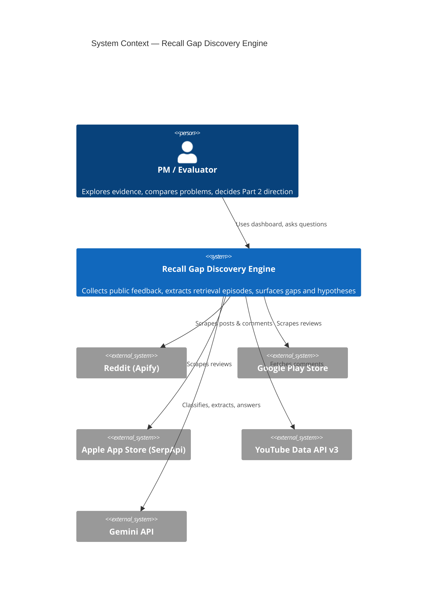
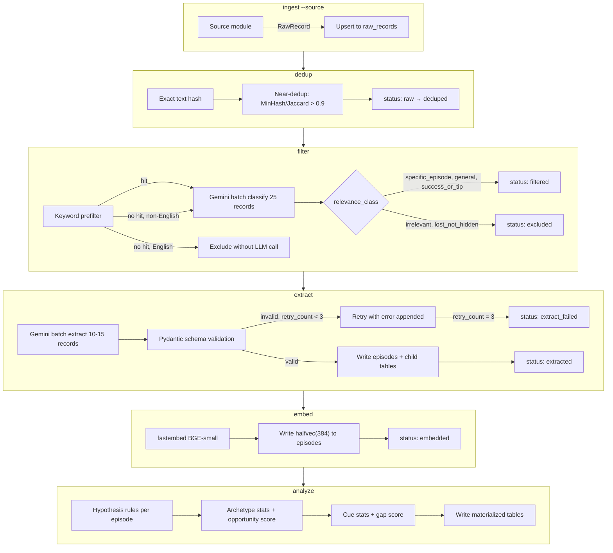
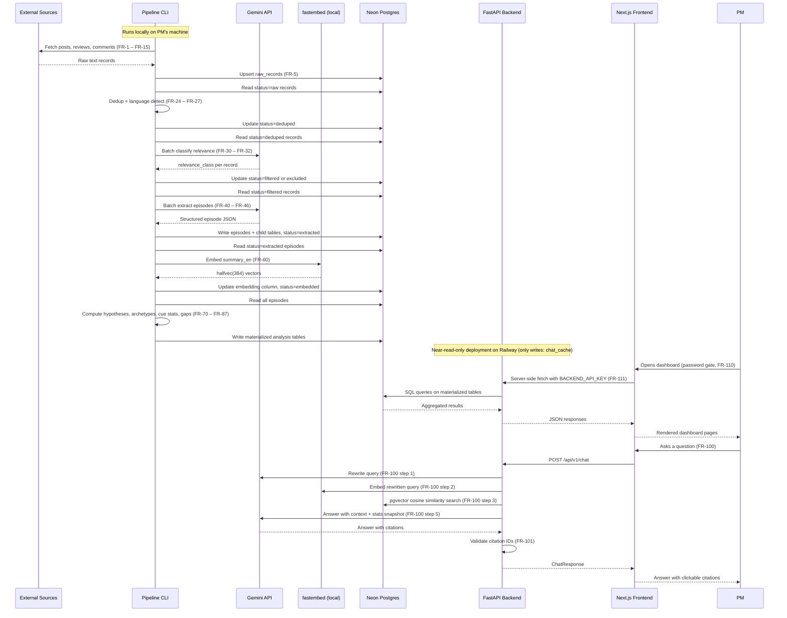
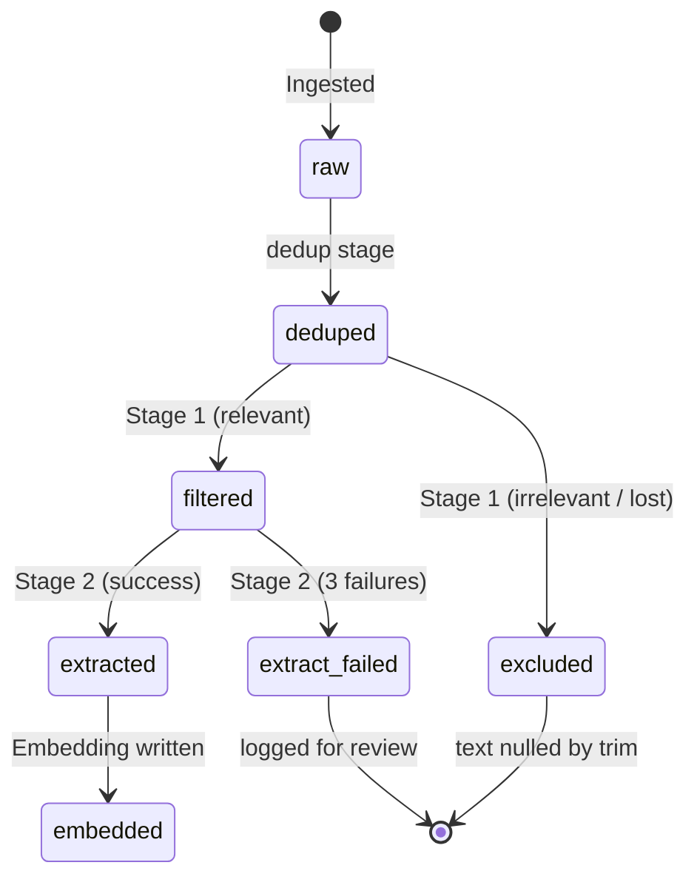
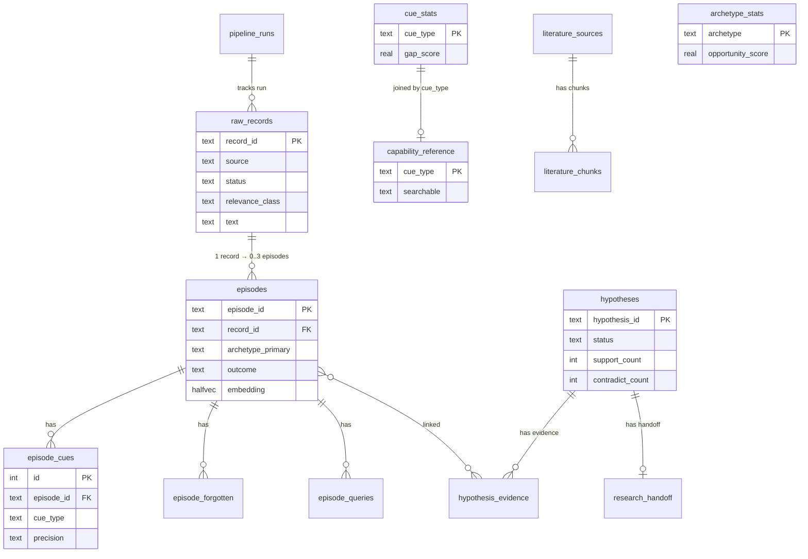
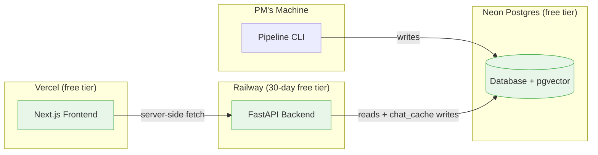

# Architecture: Recall Gap Discovery Engine

| Field | Value |
|---|---|
| Status | Approved v1 |
| Companion docs | `PRD.md` (requirements), `extraction_spec.md` (schema, enums, taxonomy) |
| Key decisions | AD-1 offline pipeline, AD-2 precomputed analysis, AD-3 full evidence traceability |

---

## 1. System context



---

## 2. Component architecture

The system has four deployable units. Each is described below with its responsibilities, boundaries, and requirement traceability.

### 2.1 Pipeline (Python CLI — runs locally)

**Responsibility:** Collect raw data from sources, deduplicate, filter for relevance, extract structured episodes, embed summaries, and compute all analysis aggregates. Writes directly to Neon Postgres. *(AD-1, FR-1 – FR-15, FR-20 – FR-62, FR-70 – FR-99)*

```
pipeline/
├── cli.py                  # Typer CLI: ingest, dedup, filter, extract, embed, analyze, etc. (FR-22)
├── sources/
│   ├── base.py             # SourceInterface: fetch(since) -> list[RawRecord]  (FR-1)
│   ├── reddit.py           # Apify reddit-scraper  (FR-8)
│   ├── playstore.py        # google-play-scraper   (FR-9)
│   ├── appstore.py         # SerpApi apple_reviews  (FR-10)
│   ├── youtube.py          # YouTube Data API v3    (FR-11)
│   ├── community_forum.py  # requests + BS4 / CSV fallback  (FR-12, P1)
│   ├── hackernews.py       # Algolia HN Search API  (FR-13, P1)
│   └── csv_import.py       # Manual import  (FR-15)
├── stages/
│   ├── dedup.py            # Exact hash + near-dedup (FR-24, FR-25)
│   ├── language.py         # langdetect + Devanagari regex + Hinglish heuristic  (FR-26)
│   ├── filter.py           # Keyword prefilter + Gemini Stage 1  (FR-30 – FR-33)
│   ├── extract.py          # Gemini Stage 2 + schema validation + retries  (FR-40 – FR-46)
│   ├── embed.py            # fastembed BGE-small-en-v1.5  (FR-60 – FR-62)
│   └── analyze.py          # Hypotheses, archetypes, cue stats, gap matrix, handoff  (FR-70 – FR-99)
├── prompts/
│   ├── filter_v1.md        # Stage 1 prompt  (FR-54)
│   └── extract_v1.md       # Stage 2 prompt  (FR-54)
├── llm/
│   ├── client.py           # Gemini HTTP client with structured output  (FR-40)
│   └── key_pool.py         # Round-robin, cooldown, RPM ceiling  (FR-50 – FR-55)
└── config.py               # All thresholds, caps, model IDs from env  (FR-7, FR-52, FR-53)
```

**Key internal flows:**



### 2.2 Shared library

**Responsibility:** Single source of truth for Pydantic models, enums, and type definitions used by both pipeline and backend. Generated from `extraction_spec.md`. *(DR-1)*

```
shared/
├── enums.py                # All enums: relevance_class, photo_category, photo_origin,
│                           # photo_age_bucket, cue_type, precision, query_style,
│                           # failure_mode, workaround, outcome, stakes, archetype,
│                           # extraction_confidence, evidence_strength, hypothesis_status
├── models.py               # Pydantic v2 models: RawRecord, Episode, CueObject,
│                           # ForgottenCue, QueryTried, HypothesisResult, ArchetypeStats,
│                           # CueStats, ChatRequest, ChatResponse, etc.
└── constants.py            # Severity weights (FR-81), stakes weights (FR-82),
                            # evidence thresholds (FR-70), hypothesis status rules (FR-74)
```

### 2.3 Backend (FastAPI — deployed on Railway)

**Responsibility:** Serve read-only APIs for the dashboard and power the RAG chat. The backend never writes research data; its only DB writes are to `chat_cache`. Rate limiting is enforced in memory. Loads BGE-small model at startup for query embedding. *(AD-1, FR-100 – FR-108, FR-210 – FR-212, NFR-1 – NFR-3)*

```
backend/
├── main.py                 # FastAPI app, CORS (FR-211), API key middleware, startup (FR-212)
├── api/
│   ├── health.py           # GET /health
│   ├── overview.py         # GET /api/v1/overview  (FR-120 – FR-124)
│   ├── hypotheses.py       # GET /api/v1/hypotheses, /api/v1/hypotheses/{id}  (FR-130 – FR-134)
│   ├── gap_matrix.py       # GET /api/v1/gap-matrix  (FR-140 – FR-144)
│   ├── archetypes.py       # GET /api/v1/archetypes, /compare  (FR-150 – FR-152)
│   ├── segments.py         # GET /api/v1/segments  (FR-160 – FR-161, P1)
│   ├── episodes.py         # GET /api/v1/episodes, /{id}, /export  (FR-170 – FR-174)
│   ├── chat.py             # POST /api/v1/chat  (FR-100 – FR-108)
│   ├── handoff.py          # GET /api/v1/handoff  (FR-190 – FR-192, P1)
│   └── how_it_works.py     # GET /api/v1/how-it-works  (FR-200 – FR-207)
├── services/
│   ├── retrieval.py        # Vector similarity search, filter logic
│   ├── chat.py             # Query rewrite → embed → retrieve → Gemini answer → citation validation
│   ├── aggregates.py       # SQL queries against materialized tables
│   └── rate_limiter.py     # In-memory: 10/min/IP, 150/day global (FR-106)
├── db.py                   # asyncpg / SQLAlchemy async connection pool
└── deps.py                 # Dependency injection: db session, embedder, API key check
```

### 2.4 Frontend (Next.js App Router — deployed on Vercel)

**Responsibility:** Dashboard UI. All data fetched server-side via route handlers with `BACKEND_API_KEY`. *(FR-110 – FR-117, FR-120 – FR-207)*

```
frontend/
├── middleware.ts            # Password gate (FR-110)
├── app/
│   ├── layout.tsx           # Sidebar nav (FR-115), global filter bar (FR-112, P1)
│   ├── page.tsx             # Redirect to /overview
│   ├── overview/page.tsx    # Page 1 (FR-120 – FR-124)
│   ├── hypotheses/page.tsx  # Page 2 (FR-130 – FR-134)
│   ├── gap-matrix/page.tsx  # Page 3 (FR-140 – FR-144)
│   ├── archetypes/page.tsx  # Page 4 (FR-150 – FR-152)
│   ├── segments/page.tsx    # Page 5 (FR-160 – FR-161, P1)
│   ├── evidence/page.tsx    # Page 6 (FR-170 – FR-174)
│   ├── ask/page.tsx         # Page 7 (FR-180 – FR-182)
│   ├── handoff/page.tsx     # Page 8 (FR-190 – FR-192, P1)
│   └── how-it-works/page.tsx# Page 9 (FR-200 – FR-207)
├── components/
│   ├── EvidenceBadge.tsx     # strong / directional / anecdotal badge (FR-114)
│   ├── ClickableCount.tsx    # Any number → evidence browser deep link (FR-113)
│   ├── FunnelChart.tsx       # Recharts funnel (FR-121)
│   ├── HeatmapTable.tsx      # Gap matrix / segment grid
│   ├── ComparePanel.tsx      # Side-by-side archetype comparison (FR-151)
│   ├── ChatPanel.tsx         # Ask the corpus (FR-180)
│   └── EpisodeDetail.tsx     # Expanded episode row (FR-172)
└── lib/
    ├── api.ts                # Server-side fetch wrapper with BACKEND_API_KEY (FR-111)
    └── types.ts              # Generated from OpenAPI schema (FR-210)
```

---

## 3. Data flow

### 3.1 End-to-end data flow



### 3.2 Record lifecycle states



*(FR-20, FR-21)*

---

## 4. Database schema

All tables live in a single Neon Postgres database with `pgvector` extension enabled. *(DR-4)*

### 4.1 Core tables

#### `raw_records` *(FR-3, FR-4, FR-5)*

```sql
CREATE TABLE raw_records (
    record_id       TEXT PRIMARY KEY,           -- source-prefixed: rd_xxx, ps_xxx, as_xxx, yt_xxx
    source          TEXT NOT NULL,              -- reddit, playstore, appstore, youtube, community, hn, csv
    item_type       TEXT NOT NULL,              -- post, comment, review
    product         TEXT NOT NULL DEFAULT 'google_photos',  -- enum: google_photos, apple_photos, samsung_gallery, other
    url             TEXT,
    author_hash     TEXT,                       -- SHA-256 first 12 chars (FR-4)
    created_at      TIMESTAMPTZ,
    lang            TEXT,                       -- en, hi, hi-Latn, other (FR-26)
    text            TEXT,                       -- nullable after trim (DR-3)
    text_len        INTEGER,
    truncated       BOOLEAN DEFAULT FALSE,      -- FR-27
    keyword_hit     BOOLEAN,                   -- FR-30
    relevance_class TEXT,                       -- enum: specific_episode, general_search_complaint, success_or_tip, lost_not_hidden, irrelevant
    relevance_reason TEXT,
    general_failure_modes TEXT[],               -- for general_search_complaint records
    platform        TEXT,                       -- android, ios, web, unknown
    mentions_ask_photos BOOLEAN,
    ask_photos_note TEXT,
    status          TEXT NOT NULL DEFAULT 'raw', -- raw, deduped, filtered, excluded, extracted, embedded, extract_failed
    retry_count     INTEGER DEFAULT 0,          -- FR-21
    last_error      TEXT,
    extra           JSONB,                      -- stars, subreddit, country, etc. (FR-3)
    ingested_at     TIMESTAMPTZ DEFAULT NOW(),
    run_id          TEXT REFERENCES pipeline_runs(run_id)
);

CREATE INDEX idx_raw_records_status ON raw_records(status);
CREATE INDEX idx_raw_records_source ON raw_records(source);
CREATE INDEX idx_raw_records_created ON raw_records(created_at);
```

#### `episodes` *(extraction_spec Section 2.2)*

```sql
CREATE TABLE episodes (
    episode_id              TEXT PRIMARY KEY,    -- record_id + _e1, _e2, _e3
    record_id               TEXT NOT NULL REFERENCES raw_records(record_id),
    episode_no              SMALLINT NOT NULL,
    target_description      TEXT NOT NULL,
    photo_category          TEXT NOT NULL,       -- enum Section 3.1
    photo_origin            TEXT NOT NULL,       -- enum Section 3.2
    photo_age_bucket        TEXT,                -- enum: under_6m, 6_12m, 1_3y, 3y_plus, unknown
    photo_age_evidence      TEXT,
    failure_modes           TEXT[] NOT NULL DEFAULT '{}',    -- enum Section 3.5
    workarounds             TEXT[] NOT NULL DEFAULT '{}',    -- enum Section 3.6
    outcome                 TEXT NOT NULL,       -- enum: found_easily, found_with_effort, gave_up, still_searching, unknown
    stakes                  TEXT NOT NULL,       -- enum: sentimental, practical_routine, practical_urgent, unknown
    role_hints              TEXT[] DEFAULT '{}',
    archetype_primary       TEXT NOT NULL,       -- enum Section 4
    archetype_secondary     TEXT,
    emergent_label          TEXT,                -- only if archetype_primary = emergent
    summary_en              TEXT NOT NULL,
    quote_original          TEXT NOT NULL,
    quote_en                TEXT NOT NULL,
    extraction_confidence   TEXT NOT NULL,       -- high, medium, low
    prompt_version          TEXT NOT NULL,       -- e.g. extract_v1  (FR-45)
    model_id                TEXT NOT NULL,       -- e.g. gemini-2.0-flash  (FR-45)
    embedding               halfvec(384),        -- FR-61
    created_at              TIMESTAMPTZ DEFAULT NOW()
);

CREATE INDEX idx_episodes_record ON episodes(record_id);
CREATE INDEX idx_episodes_archetype ON episodes(archetype_primary);
CREATE INDEX idx_episodes_category ON episodes(photo_category);
CREATE INDEX idx_episodes_outcome ON episodes(outcome);
CREATE INDEX idx_episodes_embedding ON episodes
    USING hnsw (embedding halfvec_cosine_ops)
    WITH (m = 16, ef_construction = 64);        -- FR-61
```

#### `episode_cues` *(FR-44, Section 3.3)*

```sql
CREATE TABLE episode_cues (
    id          SERIAL PRIMARY KEY,
    episode_id  TEXT NOT NULL REFERENCES episodes(episode_id) ON DELETE CASCADE,
    cue_type    TEXT NOT NULL,       -- enum Section 3.3
    value       TEXT NOT NULL,
    precision   TEXT NOT NULL        -- exact, approximate, vague
);

CREATE INDEX idx_episode_cues_episode ON episode_cues(episode_id);
CREATE INDEX idx_episode_cues_type ON episode_cues(cue_type);
```

#### `episode_forgotten` *(FR-44)*

```sql
CREATE TABLE episode_forgotten (
    id          SERIAL PRIMARY KEY,
    episode_id  TEXT NOT NULL REFERENCES episodes(episode_id) ON DELETE CASCADE,
    cue_type    TEXT NOT NULL,
    evidence    TEXT NOT NULL
);
```

#### `episode_queries` *(FR-44, Section 3.4)*

```sql
CREATE TABLE episode_queries (
    id          SERIAL PRIMARY KEY,
    episode_id  TEXT NOT NULL REFERENCES episodes(episode_id) ON DELETE CASCADE,
    query_text  TEXT NOT NULL,
    query_style TEXT NOT NULL,       -- enum Section 3.4
    position    SMALLINT NOT NULL    -- order preserved
);
```

### 4.2 Analysis tables (materialized by `analyze` command)

#### `hypotheses` *(FR-71 – FR-75)*

```sql
CREATE TABLE hypotheses (
    hypothesis_id   TEXT PRIMARY KEY,           -- H1 through H8
    title           TEXT NOT NULL,
    statement       TEXT NOT NULL,
    status          TEXT NOT NULL,              -- supported, contradicted, mixed, insufficient_data (FR-74)
    support_count   INTEGER NOT NULL DEFAULT 0,
    contradict_count INTEGER NOT NULL DEFAULT 0,
    relevant_count  INTEGER NOT NULL DEFAULT 0,
    evidence_strength TEXT NOT NULL,            -- strong, directional, anecdotal (FR-70)
    details         JSONB,                      -- distributions for H5, H6 (FR-73)
    computed_at     TIMESTAMPTZ NOT NULL
);
```

#### `hypothesis_evidence` *(FR-75)*

```sql
CREATE TABLE hypothesis_evidence (
    hypothesis_id TEXT NOT NULL REFERENCES hypotheses(hypothesis_id),
    episode_id    TEXT NOT NULL REFERENCES episodes(episode_id),
    direction     TEXT NOT NULL,                -- support, contradict
    rank          SMALLINT,                     -- top 5 support, top 3 contradict
    PRIMARY KEY (hypothesis_id, episode_id)
);
```

#### `archetype_stats` *(FR-80 – FR-83)*

```sql
CREATE TABLE archetype_stats (
    archetype           TEXT PRIMARY KEY,
    episode_count       INTEGER NOT NULL,
    share_of_episodes   REAL NOT NULL,          -- proportion of all episodes
    outcome_distribution JSONB NOT NULL,        -- {gave_up: n, found_with_effort: n, ...}
    top_cue_types       JSONB NOT NULL,         -- [{cue_type, count}, ...]
    top_failure_modes   JSONB NOT NULL,
    top_workarounds     JSONB NOT NULL,
    source_mix          JSONB NOT NULL,
    language_mix        JSONB NOT NULL,
    category_mix        JSONB NOT NULL,
    avg_severity        REAL NOT NULL,          -- FR-81 scoring
    avg_stakes_weight   REAL NOT NULL,          -- FR-82 scoring
    opportunity_score   REAL NOT NULL,          -- FR-83 formula
    evidence_strength   TEXT NOT NULL,          -- strong, directional, anecdotal
    computed_at         TIMESTAMPTZ NOT NULL
);
```

#### `funnel_stats` *(FR-88)*

```sql
CREATE TABLE funnel_stats (
    stage                   TEXT PRIMARY KEY,       -- express, understand, evaluate, refine
    episode_count           INTEGER NOT NULL,
    general_complaint_count INTEGER NOT NULL,       -- from general_failure_modes on excluded records
    gave_up_rate            REAL NOT NULL,          -- share of stage episodes with gave_up/still_searching
    avg_severity            REAL NOT NULL,          -- FR-81 scoring
    evidence_strength       TEXT NOT NULL,          -- strong, directional, anecdotal
    details                 JSONB,                  -- per-signal breakdown
    computed_at             TIMESTAMPTZ NOT NULL
);
```

Funnel stage mapping rules:
- **Express**: vague-only cues, explicit `cues_forgotten`, or no queries tried.
- **Understand**: `zero_results`, `wrong_results`, `vocabulary_mismatch`, `cue_not_supported`, `ask_photos_failure`.
- **Evaluate**: `too_many_results` or `timeline_scroll` workaround.
- **Refine**: `refinement_missing` or 3+ queries tried.

An episode can hit multiple stages.

#### `cue_stats` *(FR-85 – FR-87)*

```sql
CREATE TABLE cue_stats (
    cue_type            TEXT PRIMARY KEY,
    remembered_share    REAL NOT NULL,          -- share of episodes remembering this cue type
    precision_exact     REAL NOT NULL,          -- share with exact precision
    precision_approximate REAL NOT NULL,
    precision_vague     REAL NOT NULL,
    forgotten_count     INTEGER NOT NULL,
    failure_rate        REAL NOT NULL,          -- episodes where this is strongest cue AND outcome is negative
    gap_score           REAL,                   -- remembered_share * (1/0.5/0) based on searchable (FR-87)
    computed_at         TIMESTAMPTZ NOT NULL
);
```

#### `capability_reference` *(FR-86)*

```sql
CREATE TABLE capability_reference (
    cue_type        TEXT PRIMARY KEY,
    searchable      TEXT NOT NULL,             -- yes, partial, no
    note            TEXT,
    verified_how    TEXT,                       -- "tested on Pixel 8, Jun 2025"
    verified_at     TIMESTAMPTZ
);
```

### 4.3 Supporting tables

#### `pipeline_runs` *(FR-6)*

```sql
CREATE TABLE pipeline_runs (
    run_id      TEXT PRIMARY KEY,              -- UUID
    stage       TEXT NOT NULL,                 -- ingest, dedup, filter, extract, embed, analyze
    source      TEXT,                          -- for ingest stage
    started_at  TIMESTAMPTZ NOT NULL,
    ended_at    TIMESTAMPTZ,
    counts      JSONB,                         -- {fetched: n, stored: n, skipped: n}
    errors      JSONB,                         -- [{record_id, error}, ...]
    tokens      JSONB,                         -- {input_tokens: n, output_tokens: n} (FR-55, P1)
    status      TEXT DEFAULT 'running'         -- running, completed, failed
);
```

#### `segment_stats` *(FR-90, P1)*

```sql
CREATE TABLE segment_stats (
    dimension       TEXT NOT NULL,             -- photo_group, origin, platform, language, role, product
    value           TEXT NOT NULL,
    archetype       TEXT NOT NULL,
    episode_count   INTEGER NOT NULL,
    outcome_mix     JSONB NOT NULL,
    PRIMARY KEY (dimension, value, archetype)
);
```

#### `research_handoff` *(FR-95 – FR-97, P1)*

```sql
CREATE TABLE research_handoff (
    hypothesis_id       TEXT PRIMARY KEY REFERENCES hypotheses(hypothesis_id),
    interview_questions JSONB NOT NULL,
    task_ideas          JSONB NOT NULL,
    screener            JSONB NOT NULL,
    generated_at        TIMESTAMPTZ NOT NULL,
    model_id            TEXT NOT NULL
);
```

#### `literature_sources` / `literature_chunks` *(FR-62, P1)*

```sql
CREATE TABLE literature_sources (
    source_id   TEXT PRIMARY KEY,
    title       TEXT NOT NULL,
    authors     TEXT,
    year        INTEGER,
    url         TEXT,
    imported_at TIMESTAMPTZ DEFAULT NOW()
);

CREATE TABLE literature_chunks (
    chunk_id    TEXT PRIMARY KEY,
    source_id   TEXT NOT NULL REFERENCES literature_sources(source_id),
    chunk_text  TEXT NOT NULL,
    embedding   halfvec(384),
    position    INTEGER NOT NULL
);

CREATE INDEX idx_lit_chunks_embedding ON literature_chunks
    USING hnsw (embedding halfvec_cosine_ops);
```

#### `chat_cache` *(FR-106)*

```sql
CREATE TABLE chat_cache (
    question_hash TEXT PRIMARY KEY,
    response      JSONB NOT NULL,
    created_at    TIMESTAMPTZ DEFAULT NOW()
);
-- Application enforces 7-day TTL on reads
```

#### `eval_results` *(FR-98, P1)*

```sql
CREATE TABLE eval_results (
    run_at      TIMESTAMPTZ PRIMARY KEY,
    metrics     JSONB NOT NULL              -- {relevance_accuracy, field_accuracy, cue_recall}
);
```

#### `emergent_labels` *(FR-46, P1)*

```sql
CREATE TABLE emergent_labels (
    label           TEXT PRIMARY KEY,
    episode_count   INTEGER NOT NULL DEFAULT 0,
    status          TEXT NOT NULL DEFAULT 'pending',  -- pending, promoted, merged
    merged_into     TEXT                             -- archetype value if merged
);
```

### 4.4 Entity-relationship diagram



---

## 5. API contracts

All routes are under `/api/v1`, require `X-API-Key` header, and return JSON. Filter params (`source`, `product`, `lang`, `from`, `to`) are supported where indicated by `*`.

### 5.1 Health

```
GET /health
Response 200:
{
  "status": "ok",
  "db": "ok",
  "model_loaded": true,
  "version": "1.0.0"
}
```

### 5.2 Overview * *(FR-120 – FR-124)*

```
GET /api/v1/overview?source=&product=&lang=&from=&to=
Response 200:
{
  "kpis": {
    "total_ingested": 8432,
    "relevant_records": 1823,
    "episodes": 487,
    "success_tip_records": 34,
    "sources_active": 4,
    "date_range": { "from": "2024-09-01", "to": "2026-09-01" }
  },
  "funnel": {
    "ingested": 8432,
    "after_dedup": 7901,
    "keyword_pass": 3212,
    "llm_relevant": 1823,
    "episodes_extracted": 487
  },
  "breakdowns": {
    "by_source": { "reddit": 4210, "playstore": 2100, ... },
    "by_language": { "en": 6200, "hi": 890, ... },
    "by_relevance_class": { ... },
    "by_product": { ... }
  },
  "sufficiency": {
    "episode_target": { "current": 487, "minimum": 120, "target": 200 },
    "success_tip_target": { "current": 34, "minimum": 20, "target": 40 },
    "hypotheses_by_strength": { "strong": 3, "directional": 2, "anecdotal": 2, "insufficient": 1 }
  },
  "pipeline_health": {
    "last_runs": [ { "stage": "analyze", "ended_at": "...", "status": "completed" }, ... ],
    "failed_records": 12,
    "storage": { "used_bytes": 67108864, "limit_bytes": 524288000, "percent": 12.8 }
  }
}
```

### 5.3 Hypotheses *(FR-130 – FR-134)*

```
GET /api/v1/hypotheses
Response 200:
{
  "hypotheses": [
    {
      "hypothesis_id": "H1",
      "title": "Relational anchoring",
      "statement": "Users remember photos relative to other life events...",
      "status": "supported",
      "support_count": 42,
      "contradict_count": 8,
      "relevant_count": 50,
      "evidence_strength": "strong"
    }, ...
  ],
  "emergent_labels": [
    { "label": "shared album confusion", "episode_count": 7, "status": "pending" }
  ]
}

GET /api/v1/hypotheses/{id}
Response 200:
{
  "hypothesis_id": "H1",
  "title": "...",
  "statement": "...",
  "status": "supported",
  "support_count": 42,
  "contradict_count": 8,
  "relevant_count": 50,
  "evidence_strength": "strong",
  "details": { ... },           // distributions for H5, H6
  "top_support": [
    {
      "episode_id": "rd_123_e1",
      "summary_en": "...",
      "quote_en": "...",
      "quote_original": "...",
      "source": "reddit",
      "url": "..."
    }, ...  // up to 5
  ],
  "top_contradict": [ ... ]     // up to 3
}
```

### 5.4 Gap matrix * *(FR-140 – FR-144)*

```
GET /api/v1/gap-matrix?source=&product=&lang=&from=&to=
Response 200:
{
  "cues": [
    {
      "cue_type": "source_sender",
      "remembered_share": 0.31,
      "precision_mix": { "exact": 0.6, "approximate": 0.3, "vague": 0.1 },
      "forgotten_count": 12,
      "failure_rate": 0.78,
      "searchable": "no",
      "searchable_note": "Google Photos cannot search by who sent a photo",
      "verified_how": "Tested on Pixel 8, Aug 2025",
      "gap_score": 0.31
    }, ...
  ],
  "top_5_gaps": [ "source_sender", "time_event_anchor", "conversation_context", ... ]
}
```

### 5.5 Archetypes * *(FR-150 – FR-152)*

```
GET /api/v1/archetypes?source=&product=&lang=&from=&to=
Response 200:
{
  "archetypes": [
    {
      "archetype": "provenance_lost",
      "episode_count": 67,
      "share_of_episodes": 0.14,
      "avg_severity": 2.7,
      "avg_stakes_weight": 1.25,
      "opportunity_score": 78.3,
      "evidence_strength": "strong",
      "outcome_distribution": { "gave_up": 22, "found_with_effort": 31, ... },
      "top_cue_types": [ ... ],
      "top_failure_modes": [ ... ],
      "top_workarounds": [ ... ]
    }, ...
  ],
  "score_formula": "share_of_episodes × avg_severity × avg_stakes_weight, normalized 0–100"
}

GET /api/v1/archetypes/compare?a=provenance_lost&b=vocabulary_mismatch
Response 200:
{
  "a": { /* full archetype_stats + 3 representative quotes */ },
  "b": { /* full archetype_stats + 3 representative quotes */ }
}
```

### 5.6 Segments * *(FR-160 – FR-161, P1)*

```
GET /api/v1/segments?dimension=photo_group&source=&product=&lang=&from=&to=
Response 200:
{
  "dimension": "photo_group",
  "cells": [
    {
      "value": "memory",
      "archetype": "provenance_lost",
      "episode_count": 34,
      "gave_up_rate": 0.35,
      "is_anecdotal": false
    }, ...
  ]
}
```

### 5.7 Episodes * *(FR-170 – FR-174)*

```
GET /api/v1/episodes?source=&product=&lang=&from=&to=&archetype=&category=&outcome=&cue_type=&hypothesis=&direction=&q=&page=1&per_page=25
Response 200:
{
  "total": 487,
  "page": 1,
  "per_page": 25,
  "episodes": [
    {
      "episode_id": "rd_123_e1",
      "record_id": "rd_123",
      "summary_en": "...",
      "archetype_primary": "vocabulary_mismatch",
      "photo_category": "health_medical",
      "photo_origin": "own_camera",
      "outcome": "found_with_effort",
      "source": "reddit",
      "lang": "en",
      "created_at": "2025-03-15T...",
      "extraction_confidence": "high"
    }, ...
  ]
}

GET /api/v1/episodes/{id}
Response 200:
{
  "episode_id": "rd_123_e1",
  "record_id": "rd_123",
  "target_description": "Photo of medicine prescribed during an illness last year",
  "photo_category": "health_medical",
  "photo_origin": "unknown",
  "photo_age_bucket": "6_12m",
  "photo_age_evidence": "last year",
  "cues_remembered": [
    { "cue_type": "subject_object", "value": "medicine from doctor", "precision": "approximate" }, ...
  ],
  "cues_forgotten": [],
  "queries_tried": [
    { "query_text": "medicine", "query_style": "keyword_object", "position": 1 }, ...
  ],
  "failure_modes": ["zero_results", "vocabulary_mismatch"],
  "workarounds": ["timeline_scroll"],
  "outcome": "found_with_effort",
  "stakes": "practical_urgent",
  "role_hints": [],
  "archetype_primary": "vocabulary_mismatch",
  "archetype_secondary": "refinement_dead_end",
  "summary_en": "...",
  "quote_original": "...",
  "quote_en": "...",
  "extraction_confidence": "high",
  "source_url": "https://reddit.com/...",
  "source": "reddit",
  "lang": "en"
}

GET /api/v1/episodes/export?<same filters>
Response 200: text/csv
```

### 5.8 Chat *(FR-100 – FR-108)*

```
POST /api/v1/chat
Request:
{
  "question": "What do people remember about photos they received from friends?",
  "filters": {                  // optional
    "source": null,
    "product": null,
    "archetype": null,
    "lang": null
  }
}
Response 200:
{
  "answer": "Users who received photos from friends primarily remember the sender [E1][E3] and the conversation context [E2]...",
  "citations": [
    {
      "id": "E1",
      "episode_id": "rd_456_e1",
      "quote_en": "...",
      "quote_original": "...",
      "source": "reddit",
      "url": "https://...",
      "created_at": "2025-05-12"
    }, ...
  ],
  "literature_citations": [],   // P1
  "rewritten_query": "received photos friends remember sender conversation",
  "stats_used": true,
  "cached": false
}

Response 429:
{ "error": "Rate limit exceeded", "retry_after_seconds": 60 }
```

### 5.9 Handoff *(FR-190 – FR-192, P1)*

```
GET /api/v1/handoff
Response 200:
{
  "decisions": {
    "D1_hypotheses_to_validate": ["H1", "H2", "H3"],
    "D2_segments_to_recruit": [ ... ],
    "D3_archetype_deep_dive": "provenance_lost",
    "D4_kill_list": ["H4"]
  },
  "per_hypothesis": [
    {
      "hypothesis_id": "H1",
      "interview_questions": ["...", "..."],
      "task_ideas": ["..."],
      "screener": { "criteria": "..." },
      "generated_at": "...",
      "label": "AI draft"
    }, ...
  ]
}
```

### 5.10 How it works *(FR-200 – FR-207)*

```
GET /api/v1/how-it-works
Response 200:
{
  "question_banner": "What photos are hardest to find, and why?",
  "funnel": {
    "collect": { "count": 8432, "explanation": "..." },
    "clean": { "count": 7901, "explanation": "..." },
    "filter": { "count": 1823, "explanation": "..." },
    "extract": { "count": 487, "explanation": "..." },
    "analyze": { "explanation": "..." }
  },
  "example_episode": { /* one full episode object, preferably non-English */ },
  "eval_results": null,         // or { relevance_accuracy: 0.87, ... }
  "limitations": [ "Selection bias: ...", "Public posts only: ...", ... ],
  "technical": {
    "stack": "Next.js + FastAPI + Neon Postgres",
    "models": { "filter": "gemini-2.0-flash-lite", "extract": "gemini-2.0-flash", "chat": "gemini-2.0-flash" },
    "prompt_versions": { "filter": "v1", "extract": "v1" },
    "time_window": "2024-09-01 to 2026-09-01",
    "sources": [ { "name": "reddit", "count": 4210 }, ... ],
    "prefilter_miss_estimate": 0.02    // FR-33, P1
  }
}
```

### 5.11 Emergent labels *(FR-46)*

```
GET /api/v1/emergent-labels
Response 200:
{
  "labels": [
    { "label": "shared album confusion", "episode_count": 7, "status": "pending" }, ...
  ]
}
```

---

## 6. Security and access control

| Concern | Solution | Requirement |
|---|---|---|
| Dashboard access | Single shared password via Next.js middleware, httpOnly cookie, 7-day expiry | FR-110 |
| API access | `X-API-Key` header checked by FastAPI middleware | FR-111, FR-211 |
| Browser ↔ API isolation | Frontend calls backend only from server-side route handlers | FR-111 |
| CORS | Restricted to the Vercel deployment domain | FR-211 |
| PII | Author names hashed (SHA-256, 12 chars) before storage; no emails, profile URLs | FR-4, DR-2 |
| Secrets | All in env vars; `.env.example` committed, `.env` gitignored | NFR-5 |
| Chat abuse | 10 req/min/IP, 150 req/day global, 7-day cache | FR-106 |

---

## 7. Infrastructure and deployment



| Component | Platform | Constraints | Requirement |
|---|---|---|---|
| Database | Neon free tier | 500 MB storage, pgvector enabled, single branch | NFR-4, SM-8, SM-9 |
| Backend | Railway free tier | 30-day trial; deploy late to maximize demo window | SM-8 |
| Frontend | Vercel free tier | Env vars via dashboard | SM-8 |
| Pipeline | Local machine | Connects to Neon directly via `DATABASE_URL` | AD-1 |
| LLM | Gemini API free tier | Multiple keys in round-robin | FR-50 – FR-53 |
| Embeddings | fastembed (local ONNX) | CPU only, no PyTorch dependency | NFR-3 |

---

## 8. Cross-cutting concerns

### 8.1 Logging *(NFR-6)*

- **Pipeline:** Structured JSON logs per stage. LLM errors log key index (not key value), record ID, error type.
- **Backend:** Request/response logging with correlation IDs. Chat queries logged (without answers, for abuse monitoring).

### 8.2 Resumability and idempotency *(NFR-7, FR-20)*

- Each pipeline stage reads only records in its input status and advances them atomically in batches.
- Crashes resume from last committed batch. No partial state.
- `run-all` executes stages in order, each stage is independently resumable.

### 8.3 Reproducibility *(NFR-11)*

- Every episode stores `prompt_version` and `model_id`.
- Prompts are versioned files; editing means a new version, never in-place modification (FR-54).
- Pipeline runs are tracked with timestamps, counts, and errors (FR-6).

### 8.4 Testing *(NFR-8, NFR-9)*

| Test area | Approach |
|---|---|
| Hypothesis rules (Section 5) | Unit tests with synthetic episodes |
| Severity + opportunity scoring | Unit tests with known inputs/outputs |
| Gap scoring | Unit tests with known cue stats + capability reference |
| Schema validation | Unit tests with valid and invalid extraction outputs |
| Key pool rotation + cooldown | Unit tests mocking HTTP responses |
| Citation validation | Unit tests with mock chat responses |
| Pipeline integration (P1) | 20 synthetic records with recorded LLM responses |

---

## 9. Key architectural decisions summary

| ID | Decision | Rationale |
|---|---|---|
| AD-1 | Pipeline runs offline as CLI, writes directly to Neon. Backend never writes research data; its only DB writes are to `chat_cache`. Rate limiting is in memory. | Scraping is slow/quota-bound; Railway free tier is time-limited; near-read-only deployment is fast and reliable |
| AD-2 | All heavy analysis is precomputed and materialized | Dashboard pages serve precomputed results; only chat uses LLM at request time |
| AD-3 | Every aggregate links to episodes, every episode links to source post | Full evidence traceability is a core trust requirement (G6, US-5) |
| AD-4 | Shared Pydantic models between pipeline and backend | Single source of truth for enums and schemas prevents drift (DR-1) |
| AD-5 | halfvec(384) with HNSW for embeddings | Halves storage vs full float32; BGE-small is 384-dim; HNSW for fast cosine search |
| AD-6 | Hypothesis rules in code, not LLM | Prevents LLM confirmation bias; makes rules testable and auditable (FR-72) |
| AD-7 | Versioned prompt files, never edit in place | Reproducibility; can compare extraction quality across prompt versions |
| AD-8 | Key pool with round-robin and cooldown | Maximizes throughput on free-tier Gemini; graceful degradation on rate limits |
