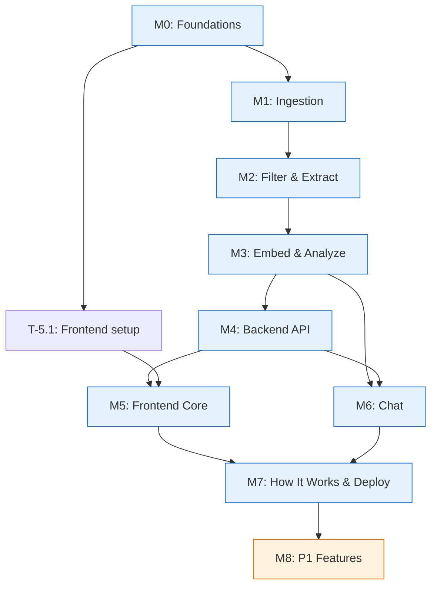

# Implementation Plan: Recall Gap Discovery Engine

| Field | Value |
|---|---|
| Status | Approved v1 |
| Companion docs | `PRD.md`, `extraction_spec.md`, `architecture.md` |
| Milestone structure | Follows PRD Section 17 (M0–M8) |

> **Convention:** Each task has an ID (`T-<milestone>.<seq>`), maps to requirement IDs, and has a priority. Dependencies are explicit.

---

## Milestone 0: Foundations

**Goal:** Repo scaffolding, shared types, database schema, env config, and KeyPool with tests.
**Done when:** `pipeline status` runs against an empty Neon DB and prints zero counts.

| Task | Description | Reqs | Priority | Depends on |
|---|---|---|---|---|
| **T-0.1** | **Repo scaffolding.** Create directory structure per `architecture.md` Section 2: `/shared`, `/pipeline` (with subdirs `sources/`, `stages/`, `prompts/`, `llm/`), `/backend` (with `api/`, `services/`), `/frontend`, `/db/migrations`, `/data` (gitignored). Create `pyproject.toml` with dependency groups (pipeline, backend, shared). Add `.env.example` with all vars from PRD 16.1. Add `.gitignore` for `/data`, `.env`, `__pycache__`, `node_modules`. | NFR-5 | P0 | — |
| **T-0.2** | **Shared enums.** Create `/shared/enums.py` with all Python `StrEnum` classes from `extraction_spec.md` Sections 1, 3.1–3.6, 4: `RelevanceClass`, `PhotoCategory`, `PhotoOrigin`, `PhotoAgeBucket`, `CueType`, `Precision`, `QueryStyle`, `FailureMode`, `Workaround`, `Outcome`, `Stakes`, `Archetype`, `ExtractionConfidence`, `EvidenceStrength`, `HypothesisStatus`. | DR-1 | P0 | T-0.1 |
| **T-0.3** | **Shared Pydantic models.** Create `/shared/models.py` with Pydantic v2 models: `RawRecord`, `CueObject`, `ForgottenCue`, `QueryTried`, `EpisodeExtraction`, `RecordExtraction`, `FilterResult`, `HypothesisRow`, `ArchetypeStatsRow`, `CueStatsRow`, `CapabilityReferenceRow`, `ChatRequest`, `ChatResponse`, `Citation`. Validate enums in field validators. | DR-1, FR-40 | P0 | T-0.2 |
| **T-0.4** | **Shared constants.** Create `/shared/constants.py` with configurable thresholds: severity weights (FR-81), stakes weights (FR-82), evidence strength thresholds (FR-70), hypothesis status rules (FR-74), opportunity score formula (FR-83), gap score formula (FR-87). All values match PRD exactly, loaded from env vars with defaults. | FR-70, FR-74, FR-81, FR-82, FR-83, FR-87 | P0 | T-0.2 |
| **T-0.5** | **Database migrations.** Create SQL migration files in `/db/migrations/` for all tables in `architecture.md` Section 4: `raw_records`, `episodes`, `episode_cues`, `episode_forgotten`, `episode_queries`, `hypotheses`, `hypothesis_evidence`, `archetype_stats`, `cue_stats`, `capability_reference`, `pipeline_runs`, `chat_cache`. Include all indexes (HNSW on embedding, status, source, etc.). Enable `pgvector` extension. | DR-4, FR-61 | P0 | T-0.1 |
| **T-0.6** | **Migration runner.** Create a simple Python migration runner (or use `yoyo-migrations`/`alembic`) that applies migrations in order against `DATABASE_URL`. CLI command: `python -m pipeline.cli migrate`. | DR-4 | P0 | T-0.5 |
| **T-0.7** | **Pipeline config.** Create `/pipeline/config.py` loading all env vars: `DATABASE_URL`, `GEMINI_API_KEYS`, model IDs, per-key RPM ceiling, source caps, time cutoff (24 months from now), batch sizes, retry limits. Validate at import time. | FR-2, FR-7, FR-52, FR-53 | P0 | T-0.1 |
| **T-0.8** | **Database connection helper.** Create `/pipeline/db.py` with sync SQLAlchemy engine and session factory for pipeline use. Create `/backend/db.py` with async connection pool (asyncpg) for backend. Both read `DATABASE_URL`. | — | P0 | T-0.5 |
| **T-0.9** | **KeyPool implementation.** Create `/pipeline/llm/key_pool.py`: parses `GEMINI_API_KEYS`, rotates round-robin, tracks per-key RPM, applies exponential backoff cooldown on 429/quota errors, pauses when all keys are cooling. | FR-50, FR-51, FR-52 | P0 | T-0.7 |
| **T-0.10** | **KeyPool unit tests.** Test rotation, cooldown, RPM ceiling enforcement, all-keys-cooling pause, and recovery. Mock HTTP responses. | NFR-8 | P0 | T-0.9 |
| **T-0.11** | **Gemini client.** Create `/pipeline/llm/client.py`: wraps `google-genai` or raw HTTP. Supports structured output (JSON mode with Pydantic schema). Uses KeyPool for key selection. Logs token usage per call (token counts to `pipeline_runs`). Configurable model ID. | FR-40, FR-53, FR-55 | P0 | T-0.9 |
| **T-0.12** | **Pipeline CLI skeleton.** Create `/pipeline/cli.py` with Typer. Register all commands as stubs: `ingest`, `dedup`, `filter`, `extract`, `embed`, `analyze`, `handoff`, `eval`, `import-csv`, `import-literature`, `trim`, `status`, `run-all`, `migrate`. Implement `status` fully: counts per status, per source, DB size via `pg_database_size`. Warn if DB size exceeds 300 MB. | FR-22, FR-23, DR-5, NFR-4 | P0 | T-0.8 |
| **T-0.13** | **Seed hypotheses.** Create a seed script or migration that inserts the 8 hypotheses (Appendix A) into the `hypotheses` table with `status = 'insufficient_data'` and zero counts. | FR-71 | P0 | T-0.5 |
| **T-0.14** | **Seed capability reference.** Create `/db/seeds/capability_reference.yaml` with initial values for each cue type's `searchable` status (yes/partial/no), note, and verification method. Write a seed loader in the CLI. | FR-86 | P0 | T-0.5 |

---

## Milestone 1: Ingestion

**Goal:** Collect real data from all P0 sources into `raw_records`.
**Done when:** Real records from Reddit, Play Store, App Store, YouTube, and CSV import are in the database. `status` shows counts per source.

| Task | Description | Reqs | Priority | Depends on |
|---|---|---|---|---|
| **T-1.1** | **Source interface.** Create `/pipeline/sources/base.py` with abstract `SourceBase`: `fetch(since: datetime) -> list[RawRecord]`. Standard fields: `record_id`, `source`, `item_type`, `product`, `url`, `author_hash`, `created_at`, `text`, `extra`. Author hashing helper (SHA-256 first 12 chars). | FR-1, FR-3, FR-4 | P0 | T-0.3 |
| **T-1.2** | **Reddit source.** Implement `/pipeline/sources/reddit.py` using Apify `harshmaur/reddit-scraper` via `run-sync-get-dataset-items`. Configure `searchTerms` (English, Hindi, Hinglish), `withinCommunity` for r/googlephotos, `searchPosts` + `searchComments` on, `postedAfter` = 24-month cutoff. Store posts and comments as separate records. Configurable max results cap. | FR-8, FR-7 | P0 | T-1.1 |
| **T-1.3** | **Play Store source.** Implement using `google-play-scraper`. App `com.google.android.apps.photos`. Locales: `en-in`, `en-us`, `hi-in`. Sort newest. Stop at cutoff date. | FR-9, FR-7 | P0 | T-1.1 |
| **T-1.4** | **App Store source.** Implement using SerpApi `engine=apple_reviews`. Google Photos iOS app ID. Countries `us`, `in`. Sort `mostrecent`. Configurable page cap. | FR-10, FR-7 | P0 | T-1.1 |
| **T-1.5** | **YouTube source.** Implement using YouTube Data API v3. `search.list` for recent videos about Google Photos search / Ask Photos. `commentThreads.list` per video. Configurable quota cap. | FR-11, FR-7 | P0 | T-1.1 |
| **T-1.6** | **CSV import command.** Implement `import-csv` accepting columns `source,url,created_at,text`. Map to `RawRecord` with `source='csv'`, generate `record_id`, hash any author column if present. | FR-15 | P0 | T-1.1 |
| **T-1.7** | **Ingest command.** Implement `ingest --source <name|all>` in CLI. For each source: call `fetch()`, upsert by `record_id` (idempotent), write `pipeline_runs` row with counts and timing. | FR-5, FR-6 | P0 | T-1.1 |
| **T-1.8** | **Dedup stage.** Implement `/pipeline/stages/dedup.py`: read `status=raw` records, compute normalized text hash (lowercase, strip whitespace/punctuation), mark exact duplicates, advance survivors to `status=deduped`. | FR-24, FR-20 | P0 | T-0.8 |
| **T-1.9** | **Language detection.** Implement `/pipeline/stages/language.py`: `langdetect` for main detection, Devanagari regex for `hi`, Hinglish marker heuristic for `hi-Latn`. Set `lang` field on each record. | FR-26 | P0 | T-1.8 |
| **T-1.10** | **Length filter.** In dedup stage or as a sub-step: exclude records < 20 chars, truncate > 1,500 words and flag `truncated=true`. | FR-27 | P0 | T-1.8 |
| **T-1.11** | **Near-dedup (P1).** Add MinHash or trigram Jaccard > 0.9 detection. Keep newest copy, mark others as duplicates. | FR-25 | P1 | T-1.8 |
| **T-1.12** | **Community forum source (P1).** Implement using `requests` + BeautifulSoup, with `import-csv` fallback if JS-rendered. | FR-12 | P1 | T-1.1 |
| **T-1.13** | **Hacker News source (P1).** Implement using Algolia HN Search API. | FR-13 | P1 | T-1.1 |
| **T-1.14** | **Competitor data sources (P1).** Play Store for Samsung Gallery; Reddit searches for Apple Photos. Tag with appropriate `product`. | FR-14 | P1 | T-1.1 |

---

## Milestone 2: Filter and Extract

**Goal:** Run Stage 1 (relevance filter) and Stage 2 (episode extraction) on all deduped records.
**Done when:** At least 50 episodes extracted end-to-end. Failed records tracked.

| Task | Description | Reqs | Priority | Depends on |
|---|---|---|---|---|
| **T-2.1** | **Keyword prefilter.** Create keyword lists (English, Hindi, Hinglish) in `/pipeline/config.py` or a YAML file. For each `status=deduped` record: check keyword hit, set `keyword_hit` flag. English records without a hit are excluded without LLM call. Non-English always go to LLM. | FR-30 | P0 | M1 |
| **T-2.2** | **Stage 1 prompt.** Write `/pipeline/prompts/filter_v1.md`: system prompt + few-shot examples for batch relevance classification into the 5 classes. Include tie-breaking rules from `extraction_spec.md` Section 1. | FR-31, FR-54 | P0 | T-0.11 |
| **T-2.3** | **Stage 1 implementation.** Implement `/pipeline/stages/filter.py`: batch ~25 records per LLM call, parse structured output (`FilterResult` per record), set `relevance_class` and `relevance_reason`, advance to `status=filtered` or `status=excluded`. Write `pipeline_runs` row. | FR-31, FR-32, FR-20, FR-6 | P0 | T-2.1, T-2.2 |
| **T-2.4** | **Stage 2 prompt.** Write `/pipeline/prompts/extract_v1.md`: system prompt with full schema definition, enum descriptions, cue type definitions, worked examples (A and B from spec), edge case rules. Bind to Pydantic `RecordExtraction` model for structured output. | FR-40, FR-54 | P0 | T-0.3 |
| **T-2.5a** | **Stage 2 LLM batching.** Implement `/pipeline/stages/extract.py` core loop: read `status=filtered` records, batch 10–15 per LLM call, call Gemini with structured output bound to `RecordExtraction` schema. Store `prompt_version` and `model_id` per call. | FR-40, FR-45 | P0 | T-2.4 |
| **T-2.5b** | **Stage 2 validation and retry.** Validate each batch response against Pydantic schema and enums. On validation failure, retry with the validation error appended to the prompt. After 3 total failures per record, mark `extract_failed` and increment `retry_count`. Log errors to `last_error`. | FR-42, FR-21, FR-20 | P0 | T-2.5a |
| **T-2.5c** | **Stage 2 episode persistence.** Write validated episodes and child tables (`episode_cues`, `episode_forgotten`, `episode_queries`) in a single transaction per batch. Advance records to `status=extracted`. Handle 0-episode results for `general_search_complaint` records by writing `general_failure_modes` to `raw_records`. | FR-43, FR-44, FR-20 | P0 | T-2.5b |
| **T-2.5d** | **Stage 2 pipeline run tracking.** Write a `pipeline_runs` row per extract invocation with counts (records processed, episodes created, failures) and timing. | FR-6 | P0 | T-2.5c |
| **T-2.6** | **Schema validation unit tests.** Test Pydantic validation with valid extractions, missing required fields, invalid enum values, too many episodes, empty cue lists, and edge cases (0 episodes for general complaints). | NFR-8 | P0 | T-0.3 |
| **T-2.7** | **Trim command.** Implement `trim` in CLI: for `status=excluded` records, set `text=NULL` to save storage while keeping `record_id`, `source`, `relevance_class`, `created_at`. | FR-32, DR-3 | P0 | T-2.3 |
| **T-2.8** | **Emergent label tracking.** When `archetype_primary='emergent'`, insert/update `emergent_labels` table with label and count. | FR-46 | P0 | T-2.5c |
| **T-2.9** | **Prefilter miss estimation (P1).** Send a configurable random 5% of keyword-miss English records to the LLM. Store results. Compute the miss rate estimate for How it works page. | FR-33 | P1 | T-2.3 |
| **T-2.10** | **English output field validation.** After extraction, validate that `summary_en` and `quote_en` are non-empty and that `summary_en`, `quote_en`, `target_description`, and all cue `value` fields are in English (using `langdetect`). If a non-English output is detected, set `extraction_confidence` to `low` instead of rejecting the record. Include unit tests for English detection and the confidence downgrade. | FR-41, NFR-8 | P0 | T-2.5b |
| **T-2.11** | **General failure modes writeback.** For `general_search_complaint` records that yield 0 episodes, ensure `general_failure_modes` from the extraction response is written back to the `raw_records` row. Test with a synthetic general complaint record. | FR-43, NFR-8 | P0 | T-2.5c |

---

## Milestone 3: Embed and Analyze

**Goal:** Embed episode summaries, compute all analysis aggregates, and populate materialized tables.
**Done when:** `analyze` populates `hypotheses`, `archetype_stats`, `cue_stats` with real data. Opportunity scores and gap scores computed.

| Task | Description | Reqs | Priority | Depends on |
|---|---|---|---|---|
| **T-3.1** | **Embedding stage.** Implement `/pipeline/stages/embed.py`: load `fastembed` with `BAAI/bge-small-en-v1.5`, embed `summary_en` of each `status=extracted` episode, write `halfvec(384)` to `episodes.embedding`, advance to `status=embedded`. | FR-60, FR-61 | P0 | M2 |
| **T-3.2** | **Hypothesis rule engine.** Implement `/pipeline/stages/analyze.py` → `compute_hypotheses()`: for each of H1–H4, H7, H8, iterate all episodes and apply the rules from `extraction_spec.md` Section 5. Classify each episode as `support`, `contradict`, or not relevant. Write to `hypothesis_evidence`. | FR-72, FR-73 | P0 | M2 |
| **T-3.3** | **Hypothesis distribution rules (H5, H6).** H5: compare cue-type and failure-mode distributions between `memory` and `utility` photo groups. H6: compute `date_imprecision` share per `photo_age_bucket` and check if it rises with age. Store distributions in `hypotheses.details` JSONB. | FR-73 | P0 | T-3.2 |
| **T-3.4** | **Hypothesis status computation.** For each hypothesis: count support, contradict, relevant episodes. Apply status rules (FR-74): `supported` if support ≥ 2× contradict and ≥ 15 relevant; `contradicted` if contradict ≥ 2× support and ≥ 15; `mixed` otherwise if ≥ 15; `insufficient_data` if < 15. Rank top 5 supporting and top 3 contradicting episodes by confidence then source diversity. Update `hypotheses` table. | FR-74, FR-75 | P0 | T-3.2 |
| **T-3.5** | **Hypothesis rule unit tests.** Create synthetic episodes covering each rule's support and contradict conditions. Test H1–H8 individually. Test edge cases (exactly at thresholds, missing fields). | NFR-8 | P0 | T-3.2 |
| **T-3.6** | **Archetype stats computation.** For each archetype: compute episode count, share, outcome distribution, top cue types (by frequency), top failure modes, top workarounds, source mix, language mix, category mix. | FR-80 | P0 | M2 |
| **T-3.7** | **Severity and opportunity scoring.** Compute per-episode severity score (FR-81 weights), per-episode stakes weight (FR-82 weights). Per archetype: `avg_severity`, `avg_stakes_weight`, `opportunity_score = share × avg_severity × avg_stakes_weight` normalized to 0–100. Compute `evidence_strength` per archetype. Write to `archetype_stats`. | FR-81, FR-82, FR-83, FR-70 | P0 | T-3.6 |
| **T-3.8** | **Scoring unit tests.** Test severity calculation with known outcomes. Test opportunity score normalization. Test edge cases (all unknown outcomes, single archetype). | NFR-8 | P0 | T-3.7 |
| **T-3.9** | **Cue stats computation.** For each cue type: compute `remembered_share` (episodes with this cue / total episodes), precision mix, `forgotten_count`, `failure_rate` (episodes where this is the strongest cue AND negative outcome). | FR-85 | P0 | M2 |
| **T-3.10** | **Gap score computation.** Join `cue_stats` with `capability_reference`: `gap_score = remembered_share × (1 if no, 0.5 if partial, 0 if yes)`. Rank by gap score. Handle missing capability entries (exclude from ranking, show "Not verified"). Write to `cue_stats`. | FR-87 | P0 | T-3.9, T-0.14 |
| **T-3.11** | **Gap scoring unit tests.** Test gap score calculation with all three searchable values. Test missing capability reference. | NFR-8 | P0 | T-3.10 |
| **T-3.12** | **Analyze command.** Wire all analysis functions into the `analyze` CLI command. Make it idempotent (truncate and rewrite materialized tables). Write `pipeline_runs` row. | FR-20 | P0 | T-3.1 – T-3.10 |
| **T-3.13** | **Literature embedding (P1).** Implement `import-literature` command: parse PDF/text, chunk, embed with BGE-small, write to `literature_sources` and `literature_chunks`. | FR-62 | P1 | T-3.1 |
| **T-3.14** | **Segment stats (P1).** Compute cross-tabs of archetype and outcome by: photo category group, origin, platform, language, role hints, product. Grey out cells under 10 episodes. Write to `segment_stats`. | FR-90, FR-91 | P1 | T-3.6 |

---

## Milestone 4: Backend API

**Goal:** All P0 API routes serving real data with auth and CORS.
**Done when:** OpenAPI docs render at `/docs`. All routes return correct data.

| Task | Description | Reqs | Priority | Depends on |
|---|---|---|---|---|
| **T-4.1** | **FastAPI app skeleton.** Create `/backend/main.py`: FastAPI app with CORS middleware (restricted to `ALLOWED_ORIGIN`), API key middleware checking `X-API-Key`, startup event loading BGE-small model. | FR-211, FR-212 | P0 | T-0.8 |
| **T-4.2** | **Health endpoint.** `GET /health`: check DB connection, confirm embedding model loaded. | — | P0 | T-4.1 |
| **T-4.3** | **Overview endpoint.** `GET /api/v1/overview`: KPIs, funnel counts, breakdowns, sufficiency vs targets, pipeline health, storage. SQL against `raw_records`, `episodes`, `pipeline_runs`, and `pg_database_size`. Support filter params. | FR-120 – FR-124 | P0 | T-4.1, M3 |
| **T-4.4** | **Hypotheses endpoints.** `GET /api/v1/hypotheses`: list all with status, counts, evidence strength. `GET /api/v1/hypotheses/{id}`: detail with top evidence episodes and distributions. `GET /api/v1/emergent-labels`: list pending labels. | FR-130 – FR-134, FR-46 | P0 | T-4.1, M3 |
| **T-4.5** | **Gap matrix endpoint.** `GET /api/v1/gap-matrix`: join `cue_stats` with `capability_reference`, return ranked by gap score. Include top 5 gaps. Support filter params. | FR-140 – FR-144 | P0 | T-4.1, M3 |
| **T-4.6** | **Archetypes endpoints.** `GET /api/v1/archetypes`: ranked list with opportunity score, counts, evidence strength. `GET /api/v1/archetypes/compare?a=&b=`: side-by-side stats with 3 representative quotes each. Support filter params. | FR-150 – FR-152 | P0 | T-4.1, M3 |
| **T-4.7** | **Episodes endpoints.** `GET /api/v1/episodes`: paginated, filterable (every enum, cue type, hypothesis direction, free-text search). `GET /api/v1/episodes/{id}`: full detail with cues, queries, source URL. | FR-170 – FR-173 | P0 | T-4.1, M3 |
| **T-4.8** | **How-it-works endpoint.** `GET /api/v1/how-it-works`: question banner, live funnel, example episode (prefer non-English), eval results (or null), limitations, technical details. | FR-200 – FR-207, FR-99 | P0 | T-4.1, M3 |
| **T-4.9** | **OpenAPI schema.** Verify auto-generated schema is complete. Set up type generation for frontend (e.g. `openapi-typescript`). | FR-210 | P0 | T-4.3 – T-4.8 |
| **T-4.10** | **Segments endpoint (P1).** `GET /api/v1/segments?dimension=`: heatmap data with anecdotal flagging. | FR-160, FR-161 | P1 | T-4.1, T-3.14 |
| **T-4.11** | **Episodes export (P1).** `GET /api/v1/episodes/export`: CSV download with same filters as list. | FR-174 | P1 | T-4.7 |
| **T-4.12** | **Handoff endpoint (P1).** `GET /api/v1/handoff`: decision summary (D1–D4) and per-hypothesis AI drafts. | FR-190 – FR-192 | P1 | T-4.1, M3 |

---

## Milestone 5: Frontend Core

**Goal:** Dashboard layout with password gate and all P0 pages except chat.
**Done when:** All pages render with real data. Every number clicks through to evidence.

| Task | Description | Reqs | Priority | Depends on |
|---|---|---|---|---|
| **T-5.1** | **Next.js project setup.** Initialize Next.js App Router project in `/frontend` with TypeScript and Tailwind CSS. Install `shadcn/ui` and `recharts`. | — | P0 | T-0.1 |
| **T-5.2** | **Password gate middleware.** Implement Next.js middleware: check for `APP_PASSWORD` cookie, redirect to login page if missing, set httpOnly cookie for 7 days on successful login. | FR-110 | P0 | T-5.1 |
| **T-5.3** | **API client layer.** Create `/frontend/lib/api.ts`: server-side fetch wrapper that adds `BACKEND_API_KEY` header. Never expose key to browser. Generate TypeScript types from OpenAPI schema. | FR-111, FR-210 | P0 | T-5.1, T-4.9 |
| **T-5.4** | **Layout and navigation.** Create app layout with left sidebar navigation in the order: Overview, Hypothesis board, Gap matrix, Archetype explorer, Segment explorer (P1 badge), Evidence browser, Ask the corpus, Research handoff (P1 badge), How it works. | FR-115 | P0 | T-5.1 |
| **T-5.5** | **Reusable components.** Build: `EvidenceBadge` (strong/directional/anecdotal), `ClickableCount` (number → evidence browser deep link with URL params), `LoadingState`, `ErrorState`, `EmptyState`. | FR-113, FR-114, FR-117 | P0 | T-5.4 |
| **T-5.6** | **Overview page.** KPI cards, relevance funnel chart (Recharts), breakdown charts (by source, language, relevance class, product), data sufficiency panel with progress bars, pipeline health section with storage bar (amber > 60%, red > 80%), failed record count (FR-21). | FR-120 – FR-124, FR-21 | P0 | T-5.5, T-4.3 |
| **T-5.7** | **Hypothesis board page.** Card per hypothesis with status badge, support vs contradict bar, evidence strength badge. Expand card to show top quotes with source links. H5/H6 show distribution charts. Sort by status, strength, or ratio. Emergent patterns section. | FR-130 – FR-134 | P0 | T-5.5, T-4.4 |
| **T-5.8** | **Gap matrix page.** Table/heatmap with rows per cue type. Columns: remembered share, precision stacked bar, forgotten count, failure rate, Photos can search (yes/partial/no), gap score. Default sort by gap score. "Top 5 gaps" callout. Hover on capability cell shows note. Secondary view: forgotten cues ranked by frequency. | FR-140 – FR-144 | P0 | T-5.5, T-4.5 |
| **T-5.9** | **Archetype explorer page.** Ranked list by opportunity score. Each card shows count, severity, stakes, evidence strength. Compare mode: pick two, render side-by-side with identical chart scales. Score formula shown in info popover. | FR-150 – FR-152 | P0 | T-5.5, T-4.6 |
| **T-5.10a** | **Evidence browser: table and pagination.** Build the paginated episodes table with columns: summary, archetype, category, origin, outcome, source, language, date. Server-side pagination with `page` and `per_page` URL params. Low-confidence episodes show a warning badge. | FR-170, FR-173 | P0 | T-5.5, T-4.7 |
| **T-5.10b** | **Evidence browser: filters and URL sync.** Add filter controls for every enum field (archetype, category, origin, outcome, stakes, confidence), cue type multi-select, hypothesis + direction picker, and free-text search on summary. All filter state synced to URL query string so views are shareable. | FR-171 | P0 | T-5.10a |
| **T-5.10c** | **Evidence browser: expandable row detail.** Clicking a row expands to show full episode detail: cues with precision, forgotten cues, queries in order with style, failure modes, workarounds, `quote_original`, `quote_en`, link to source, extraction confidence. | FR-172 | P0 | T-5.10a |
| **T-5.11** | **Global filter bar (P1).** Source, product, language, date range filters in sidebar or header. Persist in URL query string. Apply to all aggregate pages via SQL at request time. | FR-112 | P1 | T-5.4 |
| **T-5.12** | **Segment explorer page (P1).** Dimension picker, archetype × segment heatmap, cells under 10 greyed with anecdotal label. | FR-160, FR-161 | P1 | T-5.5, T-4.10 |
| **T-5.13** | **Responsive design (P1).** Ensure all pages are usable on tablet width. Mobile is best effort. | FR-116 | P1 | T-5.6 – T-5.10 |

---

## Milestone 6: Chat

**Goal:** RAG chat with citation validation, rate limiting, and caching.
**Done when:** Chat answers with valid citations or declines with "not enough evidence."

| Task | Description | Reqs | Priority | Depends on |
|---|---|---|---|---|
| **T-6.1** | **Query rewrite service.** Implement `/backend/services/chat.py` → `rewrite_query()`: Gemini rewrites user question into concise English search query, detects if it's a counting question. | FR-100 step 1 | P0 | T-4.1, T-0.11 |
| **T-6.2** | **Query embedding.** Embed rewritten query using BGE-small model (already loaded at startup). | FR-100 step 2, FR-212 | P0 | T-4.1 |
| **T-6.3** | **Episode retrieval.** Cosine similarity search against `episodes.embedding` using pgvector. Top 12 episodes. Apply optional filters (source, product, archetype, language). Check similarity threshold: if < 3 episodes above threshold, decline with suggestion. | FR-100 step 3, FR-102 | P0 | T-6.2, M3 |
| **T-6.4** | **Stats snapshot.** Build compact snapshot of precomputed stats (archetype counts, hypothesis statuses, top gaps) for inclusion in the chat system prompt so counting questions use real numbers. | FR-103 | P0 | M3 |
| **T-6.5** | **Answer generation.** Gemini generates answer using only retrieved context + stats snapshot. Context items numbered `[E1]`, `[L1]`. System prompt enforces inline citation. | FR-100 step 5, FR-101 | P0 | T-6.3, T-6.4 |
| **T-6.6** | **Citation validation.** Parse citation IDs from answer text. Validate each exists in the provided context. Strip invalid citations. Build citations list with episode_id, quote_en, quote_original, source, url, date. | FR-101, FR-104 | P0 | T-6.5 |
| **T-6.7** | **Citation validation unit tests.** Test valid citations, invalid citation stripping, edge cases (no citations, all invalid, mixed). | NFR-8 | P0 | T-6.6 |
| **T-6.8** | **Rate limiter.** Implement in-memory or Redis-based rate limiter: 10 req/min/IP, 150 req/day global. Return 429 with `retry_after_seconds`. | FR-106 | P0 | T-4.1 |
| **T-6.9** | **Chat cache.** Hash question + filters, check `chat_cache` (7-day TTL). On hit, return cached response. On miss, execute full flow and cache result. | FR-106 | P0 | T-6.6 |
| **T-6.10a** | **Chat endpoint: request handler.** Create `POST /api/v1/chat` route. Parse `ChatRequest`, apply rate limiter, check cache. On cache hit, return cached response. On miss, call the orchestrator (T-6.10b). | FR-100, FR-106 | P0 | T-6.8, T-6.9 |
| **T-6.10b** | **Chat endpoint: RAG orchestrator.** Wire together: rewrite query → embed → retrieve episodes → build stats snapshot → generate answer → validate citations. Return structured result to the handler. | FR-100 – FR-105 | P0 | T-6.1 – T-6.7, T-6.10a |
| **T-6.10c** | **Chat endpoint: response assembly and caching.** Build `ChatResponse` with answer, citations list, literature citations (empty for P0), rewritten query, stats_used flag. Write to `chat_cache`. Return to client. | FR-104, FR-106, FR-108 | P0 | T-6.10b |
| **T-6.11** | **Chat UI.** Create `/frontend/app/ask/page.tsx` and `ChatPanel` component: text input, starter questions (FR-108), loading/streaming indicator, answer with inline citations, citations panel beside answer, clickable citations → episode detail. Visible note about data sources. | FR-180 – FR-182, FR-108 | P0 | T-5.5, T-6.10 |
| **T-6.12** | **Literature retrieval (P1).** Retrieve top 4 literature chunks separately. Include as `[L1]` citations. Visually distinguish from episode citations. | FR-62, FR-105 | P1 | T-3.13, T-6.3 |
| **T-6.13** | **Multi-turn chat (P1).** Include last 3 turns as context in the Gemini call. | FR-107 | P1 | T-6.10 |

---

## Milestone 7: How It Works and Deploy

**Goal:** Page 9 complete. Live deployment behind password gate.
**Done when:** Live URL accessible behind password. All pages render with real data.

| Task | Description | Reqs | Priority | Depends on |
|---|---|---|---|---|
| **T-7.1** | **How it works page.** Build `/frontend/app/how-it-works/page.tsx`: question banner, pipeline funnel with live counts, example episode card (prefer non-English), hypothesis judging explanation, chat explanation, limitations, accuracy section (results or "not yet measured"), collapsible technical section. Must fit within 3 screen heights when collapsed. | FR-200 – FR-207, FR-99 | P0 | T-5.5, T-4.8 |
| **T-7.2** | **Backend Dockerfile.** Create Dockerfile for FastAPI backend: Python 3.11-slim, install deps, copy code, expose port. Keep image < 1 GB, memory < 512 MB at idle. | NFR-3 | P0 | M4 |
| **T-7.3** | **Deploy backend to Railway.** Push Dockerfile, set env vars (`DATABASE_URL`, `GEMINI_API_KEYS`, model IDs, `BACKEND_API_KEY`, `ALLOWED_ORIGIN`). Verify `/health` returns OK. | SM-8 | P0 | T-7.2 |
| **T-7.4** | **Deploy frontend to Vercel.** Connect repo, set env vars (`BACKEND_URL`, `BACKEND_API_KEY`, `APP_PASSWORD`). Verify login and page loads. | SM-8 | P0 | T-7.3, M5 |
| **T-7.5** | **End-to-end verification.** Walk through the release checklist (PRD 16.2): pipeline `run-all` completed, `analyze` run after final extraction, capability reference verified, How it works shows live numbers, all pages clickable. | — | P0 | T-7.3, T-7.4 |
| **T-7.6** | **Record demo video.** Screen-record a walkthrough of all pages as backup before Railway trial expires. | — | P0 | T-7.5 |
| **T-7.7** | **Structured logging.** Ensure JSON structured logging in both pipeline and backend. LLM errors log key index, never key value. Request logging in backend with correlation IDs. | NFR-6 | P0 | T-4.1, T-0.12 |

---

## Milestone 8: P1 Features

**Goal:** Build P1 features as time allows.
**Done when:** Each feature is complete and deployed.

| Task | Description | Reqs | Priority | Depends on |
|---|---|---|---|---|
| **T-8.1** | **Evaluation command.** Implement `eval --labels <csv>`: import golden set hand labels, compute relevance accuracy, per-field enum accuracy, cue recall. Store in `eval_results`. Update How it works page to show results. | FR-98, FR-99 | P1 | M2, T-7.1 |
| **T-8.2** | **Golden set fixture.** Create 20 synthetic records (including Hindi and Hinglish) with recorded LLM responses for pipeline integration tests without API calls. | NFR-9 | P1 | M2 |
| **T-8.3** | **Research handoff page.** Build page with decision summary (D1–D4), per-hypothesis AI drafts (interview questions, task ideas, screener criteria), "AI draft" labels, copy-to-clipboard, Markdown export. | FR-190 – FR-192, FR-95 – FR-97 | P1 | T-4.12, T-5.4 |
| **T-8.4** | **Handoff generation command.** Implement `handoff` CLI command: for each hypothesis with sufficient evidence, call Gemini to draft interview questions, task ideas, screener criteria grounded in evidence episodes. Store in `research_handoff`. | FR-95, FR-96 | P1 | M3 |
| **T-8.5** | **Literature layer.** Implement full literature pipeline: import-literature command, chunk, embed, store. Integrate literature chunks into chat retrieval. | FR-62, FR-105 | P1 | T-3.13, T-6.12 |
| **T-8.6** | **CSV export.** Implement episode export endpoint and download button in Evidence browser. | FR-174 | P1 | T-4.11, T-5.10 |
| **T-8.7** | **Emergent label review.** CLI commands to list, promote, or merge emergent labels. Update archetype taxonomy accordingly. | FR-46 | P1 | T-2.8 |
| **T-8.8** | **Token usage tracking.** Log input/output token counts per LLM call to `pipeline_runs.tokens`. Surface in pipeline health. | FR-55 | P1 | T-0.11 |
| **T-8.9** | **Accessibility pass.** Semantic HTML, keyboard-navigable filters, color not the only signal in charts (patterns, labels). | NFR-10 | P1 | M5 |

---

## Dependency graph

---

## Task summary

| Milestone | P0 tasks | P1 tasks | Total |
|---|---|---|---|
| M0: Foundations | 14 | 0 | 14 |
| M1: Ingestion | 10 | 4 | 14 |
| M2: Filter & Extract | 13 | 1 | 14 |
| M3: Embed & Analyze | 12 | 2 | 14 |
| M4: Backend API | 9 | 3 | 12 |
| M5: Frontend Core | 12 | 3 | 15 |
| M6: Chat | 13 | 2 | 15 |
| M7: How It Works & Deploy | 7 | 0 | 7 |
| M8: P1 Features | 0 | 9 | 9 |
| **Total** | **90** | **24** | **114** |

---

## Risk-aware sequencing notes

1. **Deploy Railway late** (M7): The 30-day free trial starts on deploy. Schedule M7 to maximize the demo window. *(Risk: Railway trial expires)*
2. **Run pipeline early and often**: Execute `ingest` + `filter` + `extract` on small batches during M2 to catch prompt issues early, before committing full quota. *(Risk: Extraction errors, Gemini quota)*
3. **Seed capability reference before M3**: The PM must verify Google Photos search capabilities on a real device before gap scores can be computed. *(OQ-2)*
4. **Golden set timing**: Ideally hand-label 30 records before the full M2 run so prompt revisions happen early. *(OQ-3)*
5. **Model ID availability**: Confirm Gemini free-tier model IDs before M0 is complete. *(OQ-4)*
