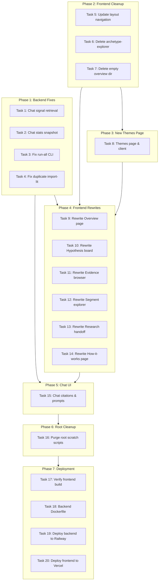

# Implementation Plan: Recall Gap Discovery Engine

| Field | Value |
|---|---|
| **Status** | Active Execution — Listening V2 Transition |
| **Last Updated** | 2026-09-29 |
| **Authoritative Specs** | [change_spec_listening_v2.md](file:///Users/shreyash/NextLeap/GP3/DiscoveryEngine/docs/change_spec_listening_v2.md) *(overrides PRD)*, [PRD.md](file:///Users/shreyash/NextLeap/GP3/DiscoveryEngine/docs/PRD.md), [extraction_spec.md](file:///Users/shreyash/NextLeap/GP3/DiscoveryEngine/docs/extraction_spec.md), [architecture.md](file:///Users/shreyash/NextLeap/GP3/DiscoveryEngine/docs/architecture.md) |
| **Databases** | **Test:** `ep-billowing-mouse` (`TEST_DATABASE_URL`) \| **Production:** `ep-weathered-rain` (`DATABASE_URL`) |

---

## Operational Guardrails & Ground Rules

1. **Database Safety:**
   - **Never edit `.env` directly.** For test runs, pass `TEST_DATABASE_URL` explicitly via environment variables or CLI flags.
   - Always snapshot a Neon branch before running any migration or bulk update.
   - Before executing any command, explicitly declare which database target is being used.
2. **LLM & Label Integrity:**
   - **Zero mocks policy:** Never mock labels or LLM outputs.
   - For 503 / 429 errors: retry with exponential backoff (up to 5 attempts), then dynamically fall back across configured working models.
   - Make pipeline stages fully resumable so interrupted batches rerun independently. If Gemini is unavailable, pause and report rather than mocking.
3. **Prompt Governance:**
   - Never edit prompt files in place; version them incrementally (`filter_v1` → `filter_v3`, `extract_v1` → `extract_v2`, `signals_v1` → `signals_v2`).
4. **Security:**
   - Never print, log, or commit secret keys or tokens.

---

## Status Summary: Completed vs Remaining

### Completed Foundations (M0 – M4 Pipeline & API)

| Area | Status | Deliverables Completed |
|---|---|---|
| **M0: Foundations** | ✅ Complete | Repo structure, shared models/enums, KeyPool rotation with backoff, CLI skeleton, 10 database migrations applied with pgvector. |
| **M1: Ingestion** | ✅ Complete | Reddit, Google Play, Apple App Store, YouTube, Hacker News, and CSV source connectors. Deduplication, length filtering, and language detection. |
| **M2: Filter & Extract** | ✅ Complete | Keyword prefilter, `filter_v3` prompt & batch execution, `extract_v2` prompt, structured validation, exclusion reason backfill. |
| **M3: Embed & Analyze (V2)** | ✅ Complete | FastEmbed BGE-small embeddings, `signals_v2` extraction with `is_signal` classification, DBSCAN theme clustering & naming (`name_themes_v1`), theme ranking formula, and data-derived hypotheses generation (`derive_hypotheses_v1`). |
| **M4: Backend API Routes** | ✅ Complete | FastAPI REST routes: `GET /api/v1/overview`, `/themes`, `/themes/{id}`, `/signals`, `/hypotheses`, `/gap-matrix`, `/episodes`, `/segments`, `/handoff`, `/how-it-works`, `/health`. Old `/archetypes` routes purged. |

---

## Remaining Execution Plan: 20 Ordered Tasks Across 7 Phases

```mermaid
graph TD
    subgraph P1["Phase 1: Backend Fixes"]
        T1["Task 1: Chat signal retrieval"]
        T2["Task 2: Chat stats snapshot"]
        T3["Task 3: Fix run-all CLI"]
        T4["Task 4: Fix duplicate import-lit"]
    end

    subgraph P2["Phase 2: Frontend Cleanup"]
        T5["Task 5: Update layout navigation"]
        T6["Task 6: Delete archetype-explorer"]
        T7["Task 7: Delete empty overview dir"]
    end

    subgraph P3["Phase 3: New Themes Page"]
        T8["Task 8: Themes page & client"]
    end

    subgraph P4["Phase 4: Frontend Rewrites"]
        T9["Task 9: Rewrite Overview page"]
        T10["Task 10: Rewrite Hypothesis board"]
        T11["Task 11: Rewrite Evidence browser"]
        T12["Task 12: Rewrite Segment explorer"]
        T13["Task 13: Rewrite Research handoff"]
        T14["Task 14: Rewrite How-it-works page"]
    end

    subgraph P5["Phase 5: Chat UI"]
        T15["Task 15: Chat citations & prompts"]
    end

    subgraph P6["Phase 6: Root Cleanup"]
        T16["Task 16: Purge root scratch scripts"]
    end

    subgraph P7["Phase 7: Deployment"]
        T17["Task 17: Verify frontend build"]
        T18["Task 18: Backend Dockerfile"]
        T19["Task 19: Deploy backend to Railway"]
        T20["Task 20: Deploy frontend to Vercel"]
    end

    P1 --> P4
    P1 --> P5
    P2 --> P3
    P2 --> P4
    P3 --> P4
    P4 --> P5
    P5 --> P6
    P6 --> P7
```

---

### Phase 1: Backend Fixes

| # | Task | Target File(s) | Description & Acceptance Criteria | Priority |
|---|---|---|---|---|
| **1** | **Update chat retrieval to use signals** | [backend/services/chat.py](file:///Users/shreyash/NextLeap/GP3/DiscoveryEngine/backend/services/chat.py) | Refactor `retrieve_episodes()` (around L133) to query the `signals` table instead of `episodes`. Filter by `is_signal = true`, compute similarity against signal text/embeddings, and return `signal_id` for citations. | ✅ Done |
| **2** | **Update chat stats snapshot** | [backend/services/chat.py](file:///Users/shreyash/NextLeap/GP3/DiscoveryEngine/backend/services/chat.py) | Refactor `get_stats_snapshot()` (around L245). Replace queries against dropped `archetype_stats` table and legacy hypothesis columns (`support_count`, `contradict_count`, `status`) with queries against `themes` (top themes, rank scores) and data-derived `hypotheses`. | ✅ Done |
| **3** | **Implement `run-all` CLI command** | [pipeline/cli.py](file:///Users/shreyash/NextLeap/GP3/DiscoveryEngine/pipeline/cli.py#L743-L746) | Replace the stub in `run-all` with sequential orchestration: `ingest` → `dedup` → `filter` → `extract` → `analyze`. Include CLI arguments (`--source`, `--target-db`, `--resume`). | ✅ Done |
| **4** | **Remove duplicate `import-literature` command** | [pipeline/cli.py](file:///Users/shreyash/NextLeap/GP3/DiscoveryEngine/pipeline/cli.py#L737-L756) | Eliminate duplicate `@app.command(name="import-literature")` registration at L737, preserving the active implementation at L749. | ✅ Done |

---

### Phase 2: Frontend Cleanup & Navigation

| # | Task | Target File(s) | Description & Acceptance Criteria | Priority |
|---|---|---|---|---|
| **5** | **Update sidebar navigation** | [frontend/src/app/(dashboard)/layout.tsx](file:///Users/shreyash/NextLeap/GP3/DiscoveryEngine/frontend/src/app/(dashboard)/layout.tsx#L10) | Replace "Archetype explorer" with "Themes" (`/themes`) positioned second immediately following "Overview". Remove any dangling references to legacy archetype navigation. | ✅ Done |
| **6** | **Delete archetype-explorer page** | [frontend/src/app/(dashboard)/archetype-explorer/](file:///Users/shreyash/NextLeap/GP3/DiscoveryEngine/frontend/src/app/(dashboard)/archetype-explorer) | Delete the obsolete directory and its components (`page.tsx`, `client.tsx`) which call decommissioned `/archetypes` endpoints. | ✅ Done |
| **7** | **Delete empty `overview/` directory** | [frontend/src/app/(dashboard)/overview/](file:///Users/shreyash/NextLeap/GP3/DiscoveryEngine/frontend/src/app/(dashboard)/overview) | Remove empty directory `frontend/src/app/(dashboard)/overview/` since Overview is rendered by `frontend/src/app/(dashboard)/page.tsx`. | ✅ Done |

---

### Phase 3: Frontend New Themes Page

| # | Task | Target File(s) | Description & Acceptance Criteria | Priority |
|---|---|---|---|---|
| **8** | **Create Themes page** | `frontend/src/app/(dashboard)/themes/page.tsx` `frontend/src/app/(dashboard)/themes/client.tsx` | Implement Listening V2 §4.4 Themes UI: Core and Adjacent scope tabs, ranked theme cards with `rank_score`, signal volume, distinct author counts, source badges, severe share bar, evidence strength badge, funnel mix, and 3 representative user quotes. Consumes `GET /api/v1/themes?scope=`. | ✅ Done |

---

### Phase 4: Frontend Page Rewrites

| # | Task | Target File(s) | Description & Acceptance Criteria | Priority |
|---|---|---|---|---|
| **9** | **Rewrite Overview page** | [frontend/src/app/(dashboard)/page.tsx](file:///Users/shreyash/NextLeap/GP3/DiscoveryEngine/frontend/src/app/(dashboard)/page.tsx) | Update KPIs to display Total Signals split by Core vs Adjacent scope. Add "Dropped at Signals" counter. Display Top 5 Core Themes table linking to `/themes`. Remove legacy archetype charts, 120-episode sufficiency references, and non-existent `pipeline_health.failed_records`. | ✅ Done |
| **10** | **Rewrite Hypothesis board** | [frontend/src/app/(dashboard)/hypothesis-board/client.tsx](file:///Users/shreyash/NextLeap/GP3/DiscoveryEngine/frontend/src/app/(dashboard)/hypothesis-board/client.tsx) | Replace legacy static H1–H8 cards and H5/H6 distribution charts with dynamic data-derived hypotheses from `/api/v1/hypotheses`. Render `statement`, `why_we_believe_it`, `counter_evidence`, `what_would_disprove_it`, `primary_funnel_stage`, and `research_question`. Split view by scope. | ✅ Done |
| **11** | **Rewrite Evidence browser** | [frontend/src/app/(dashboard)/evidence-browser/page.tsx](file:///Users/shreyash/NextLeap/GP3/DiscoveryEngine/frontend/src/app/(dashboard)/evidence-browser/page.tsx) [frontend/src/app/(dashboard)/evidence-browser/client.tsx](file:///Users/shreyash/NextLeap/GP3/DiscoveryEngine/frontend/src/app/(dashboard)/evidence-browser/client.tsx) | Switch data source from `/api/v1/episodes` to `/api/v1/signals`. Update filter bar: Scope (`core` / `adjacent`), Theme dropdown, Relevance Class, Source, Product, Funnel Stage, Outcome. Render remembered/forgotten cues in expandable signal details. | ✅ Done |
| **12** | **Rewrite Segment explorer** | [frontend/src/app/(dashboard)/segment-explorer/client.tsx](file:///Users/shreyash/NextLeap/GP3/DiscoveryEngine/frontend/src/app/(dashboard)/segment-explorer/client.tsx) | Replace `archetype` heatmap axis with `theme`. Update dimension selection from legacy photo categories to `source`, `product`, `class`, and `language` matching `/api/v1/segments`. | ✅ Done |
| **13** | **Rewrite Research handoff** | [frontend/src/app/(dashboard)/research-handoff/client.tsx](file:///Users/shreyash/NextLeap/GP3/DiscoveryEngine/frontend/src/app/(dashboard)/research-handoff/client.tsx) | Remove hardcoded D1–D4 decisions. Display ranked data-derived hypotheses paired with their `research_question`. Maintain clean Markdown export functionality. | ✅ Done |
| **14** | **Rewrite How it works page** | [frontend/src/app/(dashboard)/how-it-works/page.tsx](file:///Users/shreyash/NextLeap/GP3/DiscoveryEngine/frontend/src/app/(dashboard)/how-it-works/page.tsx) | Redesign to present the complete Listening V2 pipeline architecture: Ingestion → Keyword Prefilter → Filter V3 → Signals V2 → Embedding → Theme Clustering & Ranking → Derived Hypotheses. Render live funnel counts from `/api/v1/how-it-works`. Include Known Limitations and Accuracy sections. | ✅ Done |

---

### Phase 5: Frontend Chat UI Update

| # | Task | Target File(s) | Description & Acceptance Criteria | Priority |
|---|---|---|---|---|
| **15** | **Update Chat UI citations & starters** | [frontend/src/app/(dashboard)/ask/client.tsx](file:///Users/shreyash/NextLeap/GP3/DiscoveryEngine/frontend/src/app/(dashboard)/ask/client.tsx) | Update Citation type to use `signal_id`. Update click-through links to open corresponding signals in Evidence Browser. Revise starter prompt chips to reflect Listening V2 themes and search recall failure modes. | ✅ Done |

---

### Phase 6: Repository Cleanup

| # | Task | Target File(s) | Description & Acceptance Criteria | Priority |
|---|---|---|---|---|
| **16** | **Purge root scratch scripts** | Root directory | Relocate `model_check.py` to `pipeline/model_check.py`. Delete obsolete scratch scripts in repo root per Change Spec §4.5: `backfill_exclusion.py`, `backfill_exclusion_local.py`, `backfill_exclusion_reason.py`, `compare_counts.py`, `fix_funnel.py`, `make_changes.py`, `patch_reddit.py`, `query_funnel.py`, `report.py`, `report_v2.py`, `test_overview.py`. | ✅ Done |

---

### Phase 7: Verification & Deployment

| # | Task | Target File(s) | Description & Acceptance Criteria | Priority |
|---|---|---|---|---|
| **17** | **Verify frontend build** | `frontend/` | Execute `npm run build` within `frontend/` to confirm zero TypeScript compilation errors, dead imports, or type mismatches. | ✅ Done |
| **18** | **Create backend Dockerfile** | `Dockerfile` | Multi-stage Python 3.11-slim Dockerfile. Install requirements, fastembed assets, copy code, expose port 8000. Keep image size < 1 GB. | ✅ Done |
| **19** | **Deploy backend to Railway** | Railway CLI / Dashboard | Deploy backend container with environment variables (`DATABASE_URL`, `GEMINI_API_KEYS`, `ALLOWED_ORIGIN`). Verify `GET /health` returns 200 OK. | P0 |
| **20** | **Deploy frontend to Vercel** | Vercel CLI / Dashboard | Connect repository, configure build settings and env vars (`BACKEND_URL`, `BACKEND_API_KEY`, `APP_PASSWORD`). Validate full dashboard and login flow. | P0 |

---

## Detailed Task Specifications & Acceptance Criteria

### Task 1: Update Chat Retrieval to Use Signals
- **File:** [backend/services/chat.py](file:///Users/shreyash/NextLeap/GP3/DiscoveryEngine/backend/services/chat.py)
- **Current Issue:** Queries `episodes` table and filters by `archetype_primary`.
- **Target Changes:**
  - Query `signals` table with `WHERE is_signal = true`.
  - Embed user query using FastEmbed (`BAAI/bge-small-en-v1.5`).
  - Search using cosine distance against `signals.embedding`.
  - Return citations structured as: `{ signal_id, text, theme, source, url, confidence }`.

### Task 2: Update Chat Stats Snapshot
- **File:** [backend/services/chat.py](file:///Users/shreyash/NextLeap/GP3/DiscoveryEngine/backend/services/chat.py)
- **Current Issue:** Queries `archetype_stats` (table removed in v2) and deprecated `hypotheses` columns (`support_count`, `contradict_count`, `status`).
- **Target Changes:**
  - Query top themes from `themes` ordered by `rank_score DESC`.
  - Query data-derived hypotheses from `hypotheses` with `details->>'why_we_believe_it'`, `details->>'counter_evidence'`.
  - Include summary stats: signal counts by scope (`core` vs `adjacent`), top sources, dropped-at-signals count.

### Task 3: Implement `run-all` CLI Command
- **File:** [pipeline/cli.py](file:///Users/shreyash/NextLeap/GP3/DiscoveryEngine/pipeline/cli.py)
- **Current Issue:** `run-all` command is a stub printing `"[STUB] run-all"`.
- **Target Changes:**
  - Wire functions in order: `ingest` → `dedup` → `filter` → `extract` (signals) → `analyze` (embed, cluster themes, derive hypotheses).
  - Add optional `--source` flag (default all), `--skip-ingest` flag, and `--target-db` confirmation.

### Task 4: Fix Duplicate `import-literature` Registration
- **File:** [pipeline/cli.py](file:///Users/shreyash/NextLeap/GP3/DiscoveryEngine/pipeline/cli.py)
- **Current Issue:** Typer decorates `import-literature` at L737 (stub) and L749 (implementation).
- **Target Changes:**
  - Remove duplicate stub at L737; retain active handler at L749.

### Task 5 & 6: Sidebar Navigation & Archetype Cleanup
- **Files:** [frontend/src/app/(dashboard)/layout.tsx](file:///Users/shreyash/NextLeap/GP3/DiscoveryEngine/frontend/src/app/(dashboard)/layout.tsx), [frontend/src/app/(dashboard)/archetype-explorer/](file:///Users/shreyash/NextLeap/GP3/DiscoveryEngine/frontend/src/app/(dashboard)/archetype-explorer)
- **Target Changes:**
  - Nav items: Overview (`/`), Themes (`/themes`), Hypothesis board (`/hypothesis-board`), Gap matrix (`/gap-matrix`), Evidence browser (`/evidence-browser`), Segment explorer (`/segment-explorer`), Research handoff (`/research-handoff`), Ask the corpus (`/ask`), How it works (`/how-it-works`).
  - Delete `frontend/src/app/(dashboard)/archetype-explorer/` directory.

### Task 8: Themes Page Implementation
- **Files:** `frontend/src/app/(dashboard)/themes/page.tsx`, `frontend/src/app/(dashboard)/themes/client.tsx`
- **Target Changes:**
  - Tab selector: Core Themes vs Adjacent Themes.
  - Theme card components displaying:
    - Title, Scope tag, Rank score badge.
    - Signal count, Distinct authors count, Source distribution chips.
    - Severe complaint share (percentage bar).
    - Evidence strength rating badge (`strong`, `moderate`, `directional`).
    - Primary funnel stage distribution pill.
    - Collapsible panel with 3 illustrative verbatim user quotes.

### Task 9: Overview Page Rewrite
- **File:** [frontend/src/app/(dashboard)/page.tsx](file:///Users/shreyash/NextLeap/GP3/DiscoveryEngine/frontend/src/app/(dashboard)/page.tsx)
- **Target Changes:**
  - Hero KPIs: Total Raw Records, Total Filtered/Relevant, Signals Identified (Core + Adjacent), Dropped at Signals.
  - Funnel visual reflecting Listening V2 stages.
  - Top 5 Core Themes quick list with direct links to `/themes`.
  - Source, Product, and Relevance Class breakdowns.

### Task 10: Hypothesis Board Rewrite
- **File:** [frontend/src/app/(dashboard)/hypothesis-board/client.tsx](file:///Users/shreyash/NextLeap/GP3/DiscoveryEngine/frontend/src/app/(dashboard)/hypothesis-board/client.tsx)
- **Target Changes:**
  - Grid of data-derived hypotheses grouped by Scope.
  - Cards highlight: Statement, Why We Believe It, Counter-Evidence, What Would Disprove It, Recommended Research Question.
  - Filter by Funnel Stage and Scope.

### Task 11: Evidence Browser Rewrite
- **Files:** [frontend/src/app/(dashboard)/evidence-browser/page.tsx](file:///Users/shreyash/NextLeap/GP3/DiscoveryEngine/frontend/src/app/(dashboard)/evidence-browser/page.tsx), [frontend/src/app/(dashboard)/evidence-browser/client.tsx](file:///Users/shreyash/NextLeap/GP3/DiscoveryEngine/frontend/src/app/(dashboard)/evidence-browser/client.tsx)
- **Target Changes:**
  - Fetch from `/api/v1/signals`.
  - Filter toolbar: Scope, Relevance Class, Theme, Source, Product, Funnel Stage.
  - Table columns: Summary, Theme, Scope, Source, Date, Severity.
  - Expandable row showing full original quote, remembered cues, and forgotten cues.

### Task 12–15: Segment Explorer, Handoff, How It Works, Chat UI
- Align Segments with themes and `/api/v1/segments` response.
- Reorient Research Handoff around derived hypotheses and research questions.
- Update How It Works with Listening V2 architecture documentation and live funnel stats.
- Update Chat citations to target `signal_id` with links to Evidence Browser.

### Task 16–20: Root Cleanup & Production Deployment
- Clean root directory scratch scripts; keep `pipeline/model_check.py`.
- Run frontend type check and production bundle build (`npm run build`).
- Package backend in Docker container.
- Deploy and verify Railway backend and Vercel frontend.
